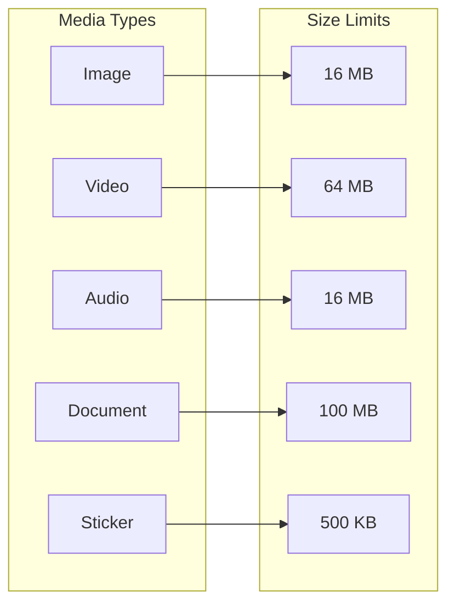
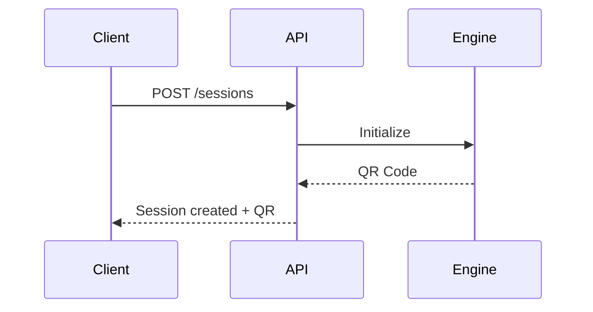
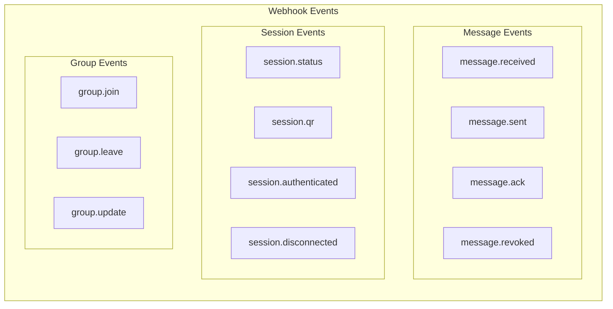

# 06 - API Specification

## 6.1 API Overview

### Base URL
```
Production: https://your-domain.com/api
Development: http://localhost:2785/api
```

### Authentication
```http
# API Key in Header
X-API-Key: your-api-key-here

# Or in Query Parameter (not recommended)
GET /api/sessions?apiKey=your-api-key-here
```

### Common Headers
```http
Content-Type: application/json
Accept: application/json
X-API-Key: your-api-key
X-Request-ID: optional-tracking-id (recommended)
```

## 6.2 Response Format

### Success Response

```json
{
  "success": true,
  "data": {},
  "meta": {
    "timestamp": "2025-02-02T10:00:00.000Z",
    "requestId": "550e8400-e29b-41d4-a716-446655440000",
    "version": "0.1.0"
  }
}
```

### Error Response

```json
{
  "success": false,
  "error": {
    "code": "ERROR_CODE",
    "message": "Human readable message",
    "details": {}
  },
  "meta": {
    "timestamp": "2025-02-02T10:00:00.000Z",
    "requestId": "550e8400-e29b-41d4-a716-446655440000"
  }
}
```

### Request ID Convention

- Recommended format: `req_<epoch_ms>` (example: `req_1706868000000`).
- `X-Request-ID` is returned in `meta.requestId` when provided by the client.

### Timestamp Conventions

- All API timestamps use ISO 8601 UTC (example: `2026-02-02T10:00:00.000Z`).
- If you need the original WhatsApp timestamp (epoch seconds), the field is named `waTimestamp`.

### Error Codes

#### General Error Codes

| Code | HTTP Status | Description |
|------|-------------|-------------|
| `VALIDATION_ERROR` | 400 | Invalid request parameters |
| `UNAUTHORIZED` | 401 | Missing or invalid API key |
| `FORBIDDEN` | 403 | Insufficient permissions |
| `NOT_FOUND` | 404 | Resource not found |
| `RATE_LIMITED` | 429 | Too many requests |
| `INTERNAL_ERROR` | 500 | Server error |

#### Session Error Codes

| Code | HTTP Status | Description |
|------|-------------|-------------|
| `SESSION_NOT_FOUND` | 404 | Session with the given ID was not found |
| `SESSION_NOT_READY` | 400 | Session not authenticated/connected |
| `SESSION_ALREADY_EXISTS` | 409 | Session with the given name already exists |
| `SESSION_INITIALIZING` | 400 | Session is currently initializing |
| `SESSION_QR_EXPIRED` | 400 | QR code expired, regeneration required |
| `SESSION_AUTH_FAILED` | 401 | WhatsApp authentication failed |
| `SESSION_DISCONNECTED` | 400 | Session disconnected from WhatsApp |
| `SESSION_LOGGED_OUT` | 400 | Session already logged out from WhatsApp |
| `SESSION_LIMIT_REACHED` | 403 | Maximum session limit reached |
| `SESSION_BANNED` | 403 | WhatsApp number has been banned |

#### Message Error Codes

| Code | HTTP Status | Description |
|------|-------------|-------------|
| `MESSAGE_SEND_FAILED` | 500 | Failed to send message to WhatsApp |
| `MESSAGE_NOT_FOUND` | 404 | Message not found |
| `MESSAGE_INVALID_CHAT_ID` | 400 | Invalid chatId format |
| `MESSAGE_NUMBER_NOT_ON_WHATSAPP` | 400 | Number is not registered on WhatsApp |
| `MESSAGE_MEDIA_TOO_LARGE` | 413 | Media size exceeds limit |
| `MESSAGE_MEDIA_DOWNLOAD_FAILED` | 400 | Failed to download media from URL |
| `MESSAGE_MEDIA_INVALID_FORMAT` | 400 | Unsupported media format |
| `MESSAGE_TEXT_TOO_LONG` | 400 | Message text exceeds character limit |
| `MESSAGE_BLOCKED_CONTACT` | 403 | Cannot send to a blocked contact |
| `MESSAGE_RATE_LIMITED` | 429 | Too many messages in a short time |
| `MESSAGE_QUOTED_NOT_FOUND` | 400 | Quoted message not found |

#### Webhook Error Codes

| Code | HTTP Status | Description |
|------|-------------|-------------|
| `WEBHOOK_NOT_FOUND` | 404 | Webhook not found |
| `WEBHOOK_URL_INVALID` | 400 | Invalid webhook URL |
| `WEBHOOK_URL_UNREACHABLE` | 400 | Webhook URL is unreachable |
| `WEBHOOK_DUPLICATE` | 409 | Webhook with this URL already exists |
| `WEBHOOK_LIMIT_REACHED` | 403 | Maximum webhook limit per session reached |

#### Group Error Codes

| Code | HTTP Status | Description |
|------|-------------|-------------|
| `GROUP_NOT_FOUND` | 404 | Group not found |
| `GROUP_NOT_ADMIN` | 403 | Not a group admin |
| `GROUP_PARTICIPANT_EXISTS` | 409 | Participant already exists in group |
| `GROUP_PARTICIPANT_NOT_FOUND` | 404 | Participant not found in the group |
| `GROUP_INVITE_INVALID` | 400 | Invalid invite link |
| `GROUP_NAME_TOO_LONG` | 400 | Group name exceeds character limit |

#### Contact Error Codes

| Code | HTTP Status | Description |
|------|-------------|-------------|
| `CONTACT_NOT_FOUND` | 404 | Contact not found |
| `CONTACT_BLOCKED` | 400 | Contact is already blocked |
| `CONTACT_NOT_BLOCKED` | 400 | Contact is not blocked |

## 6.3 Media Specifications

### Supported Media Types & Limits



### Image

| Attribute | Value |
|-----------|-------|
| **Max File Size** | 16 MB |
| **Supported Formats** | JPEG, PNG, WebP, GIF |
| **Max Resolution** | 4096 x 4096 pixels |
| **Recommended** | JPEG for photos, PNG for graphics |

```json
{
  "image": {
    "url": "https://example.com/image.jpg",
    "mimetype": "image/jpeg"
  },
  "caption": "Optional caption (max 1024 chars)"
}
```

### Video

| Attribute | Value |
|-----------|-------|
| **Max File Size** | 64 MB (WhatsApp limit: 16 MB in many regions) |
| **Supported Formats** | MP4, 3GP, AVI, MKV |
| **Recommended Codec** | H.264 video, AAC audio |
| **Max Duration** | ~3 menit (tergantung resolusi) |
| **Recommended Resolution** | 720p or lower |

```json
{
  "video": {
    "url": "https://example.com/video.mp4",
    "mimetype": "video/mp4"
  },
  "caption": "Optional caption (max 1024 chars)",
  "gifPlayback": false
}
```

### Audio

| Attribute | Value |
|-----------|-------|
| **Max File Size** | 16 MB |
| **Supported Formats** | MP3, OGG, M4A, AMR, WAV |
| **Voice Note (PTT)** | OGG Opus codec (auto-converted) |
| **Max Duration** | ~15 menit |

```json
{
  "audio": {
    "url": "https://example.com/audio.mp3",
    "mimetype": "audio/mpeg"
  },
  "ptt": true
}
```

### Document

| Attribute | Value |
|-----------|-------|
| **Max File Size** | 100 MB |
| **Supported Formats** | PDF, DOC, DOCX, XLS, XLSX, PPT, PPTX, TXT, ZIP, dll |
| **Filename** | Max 100 karakter |

```json
{
  "document": {
    "url": "https://example.com/file.pdf",
    "mimetype": "application/pdf"
  },
  "filename": "report-2025.pdf",
  "caption": "Optional caption"
}
```

### Sticker

| Attribute | Value |
|-----------|-------|
| **Max File Size** | 500 KB |
| **Format** | WebP |
| **Dimensions** | 512 x 512 pixels |
| **Animated** | Supported (WebP animated) |

```json
{
  "sticker": {
    "url": "https://example.com/sticker.webp",
    "mimetype": "image/webp"
  }
}
```

### Media Input Options

Media can be sent using three approaches:

```typescript
// Option 1: URL (recommended for large files)
{
  "image": {
    "url": "https://example.com/image.jpg"
  }
}

// Option 2: Base64 (for small files < 5MB)
{
  "image": {
    "base64": "data:image/jpeg;base64,/9j/4AAQ..."
  }
}

// Option 3: File path (for local files - server side only)
{
  "image": {
    "path": "/uploads/image.jpg"
  }
}
```

### Text Message Limits

| Type | Max Length |
|------|------------|
| Regular text message | 65,536 characters |
| Caption (image/video/document) | 1,024 characters |
| Group name | 100 characters |
| Group description | 2,048 characters |
| Contact name | 100 characters |

## 6.4 API Endpoints

### 6.4.1 Sessions

#### Create Session



```http
POST /api/sessions
```

**Request Body:**
```json
{
  "name": "my-bot",
  "webhook": {
    "url": "https://your-server.com/webhook",
    "events": ["message.received", "message.sent"]
  }
}
```

**Response (201 Created):**
```json
{
  "success": true,
  "data": {
    "id": "sess_abc123",
    "name": "my-bot",
    "status": "INITIALIZING",
    "qr": null,
    "createdAt": "2025-02-02T10:00:00.000Z"
  }
}
```

---

#### List Sessions

```http
GET /api/sessions
```

**Query Parameters:**
| Parameter | Type | Description |
|-----------|------|-------------|
| `status` | string | Filter by status |
| `page` | number | Page number (default: 1) |
| `limit` | number | Items per page (default: 20) |

**Response (200 OK):**
```json
{
  "success": true,
  "data": [
    {
      "id": "sess_abc123",
      "name": "my-bot",
      "status": "CONNECTED",
      "phoneNumber": "628123456789",
      "createdAt": "2025-02-02T10:00:00.000Z"
    }
  ],
  "pagination": {
    "page": 1,
    "limit": 20,
    "total": 1,
    "totalPages": 1
  }
}
```

---

#### Get Session

```http
GET /api/sessions/:sessionId
```

**Response (200 OK):**
```json
{
  "success": true,
  "data": {
    "id": "sess_abc123",
    "name": "my-bot",
    "status": "CONNECTED",
    "phoneNumber": "628123456789",
    "pushName": "My Bot",
    "platform": "android",
    "connectedAt": "2025-02-02T10:05:00.000Z",
    "createdAt": "2025-02-02T10:00:00.000Z"
  }
}
```

---

**Session Status Values (API):**

| Value | Description |
|-------|-------------|
| `INITIALIZING` | Session created, engine booting |
| `SCAN_QR` | QR code ready / waiting for scan |
| `CONNECTING` | QR scanned, connecting to WhatsApp |
| `CONNECTED` | Connected and ready |
| `DISCONNECTED` | Connection lost or logged out |
| `FAILED` | Fatal error, manual intervention required |

**Internal ↔ API Status Mapping:**

| Internal Status (engine/db) | API Status |
|-----------------------------|------------|
| `initializing` | `INITIALIZING` |
| `qr_ready` | `SCAN_QR` |
| `connecting` | `CONNECTING` |
| `ready` | `CONNECTED` |
| `disconnected` | `DISCONNECTED` |
| `error` | `FAILED` |

> Internal statuses appear in engine logs and database records. API responses and webhooks always use the API status values above.

---

#### Get Session QR Code

```http
GET /api/sessions/:sessionId/qr
```

**Response (200 OK):**
```json
{
  "success": true,
  "data": {
    "code": "2@ABC123...",
    "image": "data:image/png;base64,..."
  }
}
```

---

#### Delete Session

```http
DELETE /api/sessions/:sessionId
```

**Response (200 OK):**
```json
{
  "success": true,
  "data": {
    "message": "Session deleted successfully"
  }
}
```

---

#### Logout Session

```http
POST /api/sessions/:sessionId/logout
```

**Response (200 OK):**
```json
{
  "success": true,
  "data": {
    "message": "Session logged out successfully"
  }
}
```

---

### 6.4.2 Messages

#### Send Text Message

```mermaid
flowchart LR
    A[Client] -->|POST| B[/messages/send-text]
    B --> C{Validate}
    C -->|OK| D[Queue]
    D --> E[Send]
    E --> F[Response]
```

```http
POST /api/sessions/:sessionId/messages/send-text
```

**Request Body:**
```json
{
  "chatId": "628123456789@c.us",
  "text": "Hello, World!",
  "options": {
    "quotedMessageId": "optional_message_id",
    "mentionedIds": ["628111111111@c.us"]
  }
}
```

**Response (200 OK):**
```json
{
  "success": true,
  "data": {
    "messageId": "true_628123456789@c.us_3EB0ABC123",
    "status": "sent",
    "timestamp": "2025-02-02T10:00:00.000Z"
  }
}
```

---

#### Send Image

```http
POST /api/sessions/:sessionId/messages/send-image
```

**Request Body:**
```json
{
  "chatId": "628123456789@c.us",
  "image": {
    "url": "https://example.com/image.jpg"
  },
  "caption": "Check this out!"
}
```

**Alternative - Base64:**
```json
{
  "chatId": "628123456789@c.us",
  "image": {
    "base64": "data:image/jpeg;base64,/9j/4AAQ..."
  },
  "caption": "Check this out!"
}
```

**Response (200 OK):**
```json
{
  "success": true,
  "data": {
    "messageId": "true_628123456789@c.us_3EB0ABC124",
    "status": "sent",
    "timestamp": "2025-02-02T10:00:00.000Z"
  }
}
```

---

#### Send Video

```http
POST /api/sessions/:sessionId/messages/send-video
```

**Request Body:**
```json
{
  "chatId": "628123456789@c.us",
  "video": {
    "url": "https://example.com/video.mp4"
  },
  "caption": "Watch this!"
}
```

---

#### Send Audio

```http
POST /api/sessions/:sessionId/messages/send-audio
```

**Request Body:**
```json
{
  "chatId": "628123456789@c.us",
  "audio": {
    "url": "https://example.com/audio.mp3"
  },
  "ptt": true
}
```

| Field | Type | Description |
|-------|------|-------------|
| `ptt` | boolean | Send as voice note (push-to-talk) |

---

#### Send Document

```http
POST /api/sessions/:sessionId/messages/send-document
```

**Request Body:**
```json
{
  "chatId": "628123456789@c.us",
  "document": {
    "url": "https://example.com/file.pdf"
  },
  "filename": "report.pdf",
  "caption": "Here is the document"
}
```

---

#### Send Location

```http
POST /api/sessions/:sessionId/messages/send-location
```

**Request Body:**
```json
{
  "chatId": "628123456789@c.us",
  "latitude": -6.2088,
  "longitude": 106.8456,
  "description": "Jakarta, Indonesia"
}
```

---

#### Send Contact

```http
POST /api/sessions/:sessionId/messages/send-contact
```

**Request Body:**
```json
{
  "chatId": "628123456789@c.us",
  "contact": {
    "name": "John Doe",
    "phone": "628987654321"
  }
}
```

---

#### Send Bulk Messages

Send messages to multiple recipients in a single request. The system processes them asynchronously with delays between messages to reduce ban risk.

```mermaid
flowchart LR
    A[Client] -->|POST| B[/messages/send-bulk]
    B --> C[Validate]
    C --> D[Create Batch Job]
    D --> E[Queue Messages]
    E --> F[Process with Delay]
    F --> G[Batch ID Response]
```

```http
POST /api/sessions/:sessionId/messages/send-bulk
```

**Request Body:**
```json
{
  "batchId": "batch_custom_123",
  "messages": [
    {
      "chatId": "628123456789@c.us",
      "type": "text",
      "content": {
        "text": "Hello {name}!"
      },
      "variables": {
        "name": "John"
      }
    },
    {
      "chatId": "628987654321@c.us",
      "type": "image",
      "content": {
        "image": { "url": "https://example.com/promo.jpg" },
        "caption": "Special offer for {name}!"
      },
      "variables": {
        "name": "Jane"
      }
    }
  ],
  "options": {
    "delayBetweenMessages": 5000,
    "randomizeDelay": true,
    "stopOnError": false
  }
}
```

**Request Fields:**

| Field | Type | Required | Description |
|-------|------|----------|-------------|
| `batchId` | string | No | Custom batch ID (auto-generated if not provided) |
| `messages` | array | Yes | Array of messages (max 100 per request) |
| `messages[].chatId` | string | Yes | Recipient chat ID |
| `messages[].type` | string | Yes | Message type: `text`, `image`, `video`, `audio`, `document` |
| `messages[].content` | object | Yes | Message content based on type |
| `messages[].variables` | object | No | Variables for template substitution |
| `options.delayBetweenMessages` | number | No | Delay in ms (default: 3000, min: 1000) |
| `options.randomizeDelay` | boolean | No | Add random 0-2s to delay (default: true) |
| `options.stopOnError` | boolean | No | Stop batch on first error (default: false) |

**Response (202 Accepted):**
```json
{
  "success": true,
  "data": {
    "batchId": "batch_abc123xyz",
    "status": "processing",
    "totalMessages": 2,
    "estimatedCompletionTime": "2025-02-02T10:05:00.000Z",
    "statusUrl": "/api/sessions/sess_abc123/messages/batch/batch_abc123xyz"
  }
}
```

---

#### Get Batch Status

```http
GET /api/sessions/:sessionId/messages/batch/:batchId
```

**Response (200 OK):**
```json
{
  "success": true,
  "data": {
    "batchId": "batch_abc123xyz",
    "status": "completed",
    "progress": {
      "total": 100,
      "sent": 95,
      "failed": 5,
      "pending": 0
    },
    "results": [
      {
        "chatId": "628123456789@c.us",
        "status": "sent",
        "messageId": "true_628123456789@c.us_3EB0ABC123"
      },
      {
        "chatId": "628111111111@c.us",
        "status": "failed",
        "error": {
          "code": "MESSAGE_NUMBER_NOT_ON_WHATSAPP",
          "message": "Number not registered on WhatsApp"
        }
      }
    ],
    "startedAt": "2025-02-02T10:00:00.000Z",
    "completedAt": "2025-02-02T10:08:30.000Z"
  }
}
```

---

#### Cancel Batch

```http
POST /api/sessions/:sessionId/messages/batch/:batchId/cancel
```

**Response (200 OK):**
```json
{
  "success": true,
  "data": {
    "batchId": "batch_abc123xyz",
    "status": "cancelled",
    "progress": {
      "total": 100,
      "sent": 45,
      "failed": 2,
      "cancelled": 53
    }
  }
}
```

---

#### Get Messages

```http
GET /api/sessions/:sessionId/chats/:chatId/messages
```

**Query Parameters:**
| Parameter | Type | Description |
|-----------|------|-------------|
| `limit` | number | Number of messages (default: 50) |
| `before` | string | Get messages before this ID |

**Response (200 OK):**
```json
{
  "success": true,
  "data": [
    {
      "id": "true_628123456789@c.us_3EB0ABC123",
      "from": "628123456789@c.us",
      "to": "628987654321@c.us",
      "body": "Hello!",
      "type": "chat",
      "waTimestamp": 1706868000,
      "timestamp": "2025-02-02T10:00:00.000Z",
      "fromMe": false,
      "hasMedia": false
    }
  ]
}
```

---

### 6.4.3 Contacts

#### Get All Contacts

```http
GET /api/sessions/:sessionId/contacts
```

**Response (200 OK):**
```json
{
  "success": true,
  "data": [
    {
      "id": "628123456789@c.us",
      "name": "John Doe",
      "pushName": "John",
      "isMyContact": true,
      "isBlocked": false
    }
  ]
}
```

---

#### Check Number Exists

```http
GET /api/sessions/:sessionId/contacts/check/:phone
```

**Response (200 OK):**
```json
{
  "success": true,
  "data": {
    "exists": true,
    "chatId": "628123456789@c.us"
  }
}
```

---

#### Get Profile Picture

```http
GET /api/sessions/:sessionId/contacts/:contactId/profile-picture
```

**Response (200 OK):**
```json
{
  "success": true,
  "data": {
    "url": "https://pps.whatsapp.net/..."
  }
}
```

---

### 6.4.4 Groups

#### Get All Groups

```http
GET /api/sessions/:sessionId/groups
```

**Response (200 OK):**
```json
{
  "success": true,
  "data": [
    {
      "id": "628123456789-1234567890@g.us",
      "name": "Family Group",
      "description": "Family chat",
      "participantsCount": 10,
      "createdAt": "2024-01-01T00:00:00.000Z"
    }
  ]
}
```

---

#### Get Group Info

```http
GET /api/sessions/:sessionId/groups/:groupId
```

**Response (200 OK):**
```json
{
  "success": true,
  "data": {
    "id": "628123456789-1234567890@g.us",
    "name": "Family Group",
    "description": "Family chat",
    "owner": "628123456789@c.us",
    "participants": [
      {
        "id": "628123456789@c.us",
        "isAdmin": true,
        "isSuperAdmin": true
      }
    ],
    "createdAt": "2024-01-01T00:00:00.000Z"
  }
}
```

---

#### Create Group

```http
POST /api/sessions/:sessionId/groups
```

**Request Body:**
```json
{
  "name": "New Group",
  "participants": [
    "628123456789@c.us",
    "628987654321@c.us"
  ]
}
```

---

### 6.4.5 Webhooks

#### Register Webhook

```http
POST /api/sessions/:sessionId/webhooks
```

**Request Body:**
```json
{
  "url": "https://your-server.com/webhook",
  "events": [
    "message.received",
    "message.sent",
    "message.ack",
    "session.status"
  ],
  "secret": "your-webhook-secret",
  "headers": {
    "X-Custom-Header": "value"
  }
}
```

**Response (201 Created):**
```json
{
  "success": true,
  "data": {
    "id": "wh_xyz789",
    "url": "https://your-server.com/webhook",
    "events": ["message.received", "message.sent"],
    "active": true,
    "createdAt": "2025-02-02T10:00:00.000Z"
  }
}
```

---

#### List Webhooks

```http
GET /api/sessions/:sessionId/webhooks
```

---

#### Delete Webhook

```http
DELETE /api/sessions/:sessionId/webhooks/:webhookId
```

---

### 6.4.6 Health

#### Basic Health Check

```http
GET /health
```

**Response (200 OK):**
```json
{
  "status": "ok",
  "timestamp": "2026-02-02T10:30:00Z"
}
```

The basic endpoint is public. The detailed endpoint requires an API key.

#### Detailed Health Check

```http
GET /health/detailed
```

**Response (200 OK):**
```json
{
  "status": "ok",
  "version": "0.1.0",
  "uptime": 3600,
  "timestamp": "2026-02-02T10:30:00Z",
  "checks": {
    "database": "ok",
    "redis": "ok",
    "sessions": {
      "total": 5,
      "connected": 4,
      "disconnected": 1
    }
  }
}
```

## 6.4 Webhook Events

### Event Structure

```json
{
  "event": "message.received",
  "timestamp": "2025-02-02T10:00:00.000Z",
  "sessionId": "sess_abc123",
  "deliveryId": "dlv_550e8400e29b41d4a716446655440000",
  "idempotencyKey": "msg_628123456789_1706868000000",
  "data": {},
  "signature": "sha256=..."
}
```

### Webhook Idempotency

OpenWA provides an idempotency mechanism to prevent duplicate processing on the client side.

#### Idempotency Headers & Fields

| Field/Header | Description |
|--------------|-------------|
| `deliveryId` | Unique ID for each delivery attempt |
| `idempotencyKey` | Unique key per event (same across retries) |
| `X-OpenWA-Delivery-Id` | Header carrying the delivery ID |
| `X-OpenWA-Idempotency-Key` | Header carrying the idempotency key |
| `X-OpenWA-Retry-Count` | Retry attempt number (0 = first attempt) |

#### Idempotency Key Format

```
Format: {event_type}_{unique_identifier}_{timestamp}

Examples:
- message.received: msg_{messageId}_{timestamp}
- message.sent: msg_{messageId}_{timestamp}
- message.ack: ack_{messageId}_{ackLevel}_{timestamp}
- session.status: sess_{sessionId}_{status}_{timestamp}
- group.join: grp_{groupId}_{participantId}_{timestamp}
```

#### Client-Side Idempotency Implementation

```typescript
// Recommended: Store processed idempotency keys
const processedEvents = new Map<string, number>(); // key -> timestamp
const IDEMPOTENCY_TTL = 24 * 60 * 60 * 1000; // 24 hours

async function handleWebhook(req: Request, res: Response) {
  const idempotencyKey = req.headers['x-openwa-idempotency-key'] as string;
  const retryCount = parseInt(req.headers['x-openwa-retry-count'] as string) || 0;

  // Check if already processed
  if (processedEvents.has(idempotencyKey)) {
    console.log(`Duplicate event ignored: ${idempotencyKey} (retry: ${retryCount})`);
    return res.status(200).json({ status: 'duplicate_ignored' });
  }

  try {
    // Process the webhook
    await processEvent(req.body);

    // Mark as processed
    processedEvents.set(idempotencyKey, Date.now());

    // Cleanup old entries periodically
    cleanupOldEntries();

    return res.status(200).json({ status: 'processed' });
  } catch (error) {
    // Return 500 to trigger retry
    return res.status(500).json({ error: error.message });
  }
}

function cleanupOldEntries() {
  const now = Date.now();
  for (const [key, timestamp] of processedEvents.entries()) {
    if (now - timestamp > IDEMPOTENCY_TTL) {
      processedEvents.delete(key);
    }
  }
}
```

#### Database-Based Idempotency (Production)

```sql
-- Create idempotency table
CREATE TABLE webhook_idempotency (
    idempotency_key VARCHAR(255) PRIMARY KEY,
    processed_at TIMESTAMP WITH TIME ZONE NOT NULL DEFAULT NOW(),
    response_data JSONB
);

-- Index for cleanup
CREATE INDEX idx_webhook_idempotency_processed_at
    ON webhook_idempotency(processed_at);

-- Cleanup job (run daily)
DELETE FROM webhook_idempotency
WHERE processed_at < NOW() - INTERVAL '24 hours';
```

```typescript
// Production implementation with PostgreSQL
async function handleWebhookWithDB(req: Request, res: Response) {
  const idempotencyKey = req.headers['x-openwa-idempotency-key'] as string;

  try {
    // Try to insert (will fail if duplicate)
    await db.query(`
      INSERT INTO webhook_idempotency (idempotency_key)
      VALUES ($1)
      ON CONFLICT (idempotency_key) DO NOTHING
      RETURNING idempotency_key
    `, [idempotencyKey]);

    const result = await db.query(
      'SELECT 1 FROM webhook_idempotency WHERE idempotency_key = $1',
      [idempotencyKey]
    );

    if (result.rowCount === 0) {
      // Already processed
      return res.status(200).json({ status: 'duplicate_ignored' });
    }

    // Process the webhook
    await processEvent(req.body);

    return res.status(200).json({ status: 'processed' });
  } catch (error) {
    return res.status(500).json({ error: error.message });
  }
}
```

### Event Types



### message.received

```json
{
  "event": "message.received",
  "timestamp": "2025-02-02T10:00:00.000Z",
  "sessionId": "sess_abc123",
  "data": {
    "id": "true_628123456789@c.us_3EB0ABC123",
    "from": "628123456789@c.us",
    "to": "628987654321@c.us",
    "body": "Hello!",
    "type": "chat",
    "waTimestamp": 1706868000,
    "timestamp": "2025-02-02T10:00:00.000Z",
    "isGroup": false,
    "hasMedia": false,
    "contact": {
      "name": "John Doe",
      "pushName": "John"
    }
  }
}
```

### message.ack

```json
{
  "event": "message.ack",
  "timestamp": "2025-02-02T10:00:00.000Z",
  "sessionId": "sess_abc123",
  "data": {
    "messageId": "true_628123456789@c.us_3EB0ABC123",
    "ack": 3,
    "ackName": "read"
  }
}
```

| Ack | Name | Description |
|-----|------|-------------|
| 0 | error | Error |
| 1 | pending | Pending |
| 2 | sent | Sent to server |
| 3 | delivered | Delivered |
| 4 | read | Read |
| 5 | played | Played (audio) |

### session.status

```json
{
  "event": "session.status",
  "timestamp": "2025-02-02T10:00:00.000Z",
  "sessionId": "sess_abc123",
  "data": {
    "status": "CONNECTED",
    "phoneNumber": "628123456789"
  }
}
```

## 6.5 Webhook Signature Verification

```javascript
const crypto = require('crypto');

function verifyWebhookSignature(payload, signature, secret) {
  const expected = 'sha256=' + crypto
    .createHmac('sha256', secret)
    .update(JSON.stringify(payload))
    .digest('hex');
  
  return crypto.timingSafeEqual(
    Buffer.from(signature),
    Buffer.from(expected)
  );
}

// Usage in Express
app.post('/webhook', (req, res) => {
  const signature = req.headers['x-openwa-signature'];
  
  if (!verifyWebhookSignature(req.body, signature, WEBHOOK_SECRET)) {
    return res.status(401).send('Invalid signature');
  }
  
  // Process webhook...
  res.status(200).send('OK');
});
```

## 6.6 Rate Limiting

| Endpoint Category | Rate Limit |
|-------------------|------------|
| Session management | 10 req/min |
| Send message | 60 req/min |
| Read operations | 120 req/min |
| Webhook management | 10 req/min |

**Rate Limit Headers:**
```http
X-RateLimit-Limit: 60
X-RateLimit-Remaining: 45
X-RateLimit-Reset: 1706868060
```

## 6.7 WebSocket Real-time API

In addition to the REST API, OpenWA provides WebSocket for real-time updates.

> [!IMPORTANT]
> The WebSocket format below is **canonical**. Client/server implementations must follow this `WSRequest/WSResponse` structure.

### Connection

**WebSocket URL:**
```
wss://your-domain.com/ws
wss://your-domain.com/ws?apiKey=your-api-key  # browser fallback
```

**Header (recommended for non-browser clients):**
```http
X-API-Key: your-api-key
```

```javascript
// Browser (query param)
const ws = new WebSocket('wss://your-domain.com/ws?apiKey=your-api-key');
```

### Message Protocol

All messages use JSON format:

```typescript
// Client -> Server (Request)
interface WSRequest {
  type: 'subscribe' | 'unsubscribe' | 'ping';
  payload?: {
    sessionId?: string;
    events?: string[];
  };
  requestId?: string; // For tracking responses
}

// Server -> Client (Response/Event)
interface WSResponse {
  type: 'subscribed' | 'unsubscribed' | 'event' | 'error' | 'pong';
  payload: any;
  requestId?: string;
  timestamp: string; // ISO 8601 UTC
}
```

### Subscribe / Unsubscribe

```javascript
// Subscribe to specific session
ws.send(JSON.stringify({
  type: 'subscribe',
  payload: {
    sessionId: 'sess_abc123',
    events: ['message.received', 'message.ack', 'session.status']
  },
  requestId: 'req_001'
}));

// Subscribe to all sessions
ws.send(JSON.stringify({
  type: 'subscribe',
  payload: {
    sessionId: '*',
    events: ['*']
  }
}));

// Unsubscribe
ws.send(JSON.stringify({
  type: 'unsubscribe',
  payload: { sessionId: 'sess_abc123' }
}));
```

### Event Types

| Event | Description |
|-------|-------------|
| `session.status` | Session status changed (INITIALIZING, SCAN_QR, CONNECTING, CONNECTED, DISCONNECTED, FAILED) |
| `session.qr` | New QR code generated |
| `session.authenticated` | Session authenticated |
| `session.disconnected` | Session disconnected |
| `message.received` | New incoming message |
| `message.sent` | Message sent successfully |
| `message.ack` | Message acknowledgment (delivered, read) |
| `message.revoked` | Message was deleted |
| `group.join` | Group join event |
| `group.leave` | Group leave event |
| `group.update` | Group info updated |

### Event Payload Examples

**session.qr:**
```json
{
  "type": "event",
  "payload": {
    "event": "session.qr",
    "sessionId": "sess_abc123",
    "data": {
      "code": "2@ABC123XYZ...",
      "image": "data:image/png;base64,..."
    }
  },
  "timestamp": "2026-02-02T10:00:00.000Z"
}
```

**message.received:**
```json
{
  "type": "event",
  "payload": {
    "event": "message.received",
    "sessionId": "sess_abc123",
    "data": {
      "messageId": "true_628123456789@c.us_3EB0ABC",
      "chatId": "628123456789@c.us",
      "from": "628123456789@c.us",
      "type": "text",
      "body": "Hello!",
      "waTimestamp": 1706868000,
      "timestamp": "2026-02-02T10:00:00.000Z",
      "isGroup": false
    }
  },
  "timestamp": "2026-02-02T10:00:00.000Z"
}
```

### Keep-Alive

```javascript
// Client should send ping every 30 seconds
setInterval(() => {
  ws.send(JSON.stringify({ type: 'ping', requestId: 'ping-001' }));
}, 30000);
```

### Quick Client Example (JavaScript)

```javascript
const ws = new WebSocket('ws://localhost:2785/ws?apiKey=your-api-key');
let pingInterval = null;

ws.onopen = () => {
  ws.send(JSON.stringify({
    type: 'subscribe',
    payload: {
      sessionId: 'sess_abc123',
      events: ['message.received', 'session.status']
    },
    requestId: 'req_001'
  }));

  pingInterval = setInterval(() => {
    ws.send(JSON.stringify({ type: 'ping', requestId: `ping_${Date.now()}` }));
  }, 30000);
};

ws.onmessage = (event) => {
  const msg = JSON.parse(event.data);
  if (msg.type === 'event') {
    console.log('Event:', msg.payload.event, msg.payload.data);
  }
};

ws.onclose = () => {
  if (pingInterval) clearInterval(pingInterval);
};
```

### Error Handling

```json
{
  "type": "error",
  "payload": {
    "code": "SESSION_NOT_FOUND",
    "message": "Session sess_xxx not found"
  },
  "requestId": "req_001",
  "timestamp": "2026-02-02T10:00:00.000Z"
}
```

## 6.8 OpenAPI/Swagger

Swagger UI tersedia di:
```
http://localhost:2785/api/docs
```

OpenAPI JSON:
```
http://localhost:2785/api/docs-json
```

## 6.9 SDK & Code Examples

### Official SDKs (Coming Soon)

| Language | Package | Status |
|----------|---------|--------|
| JavaScript/TypeScript | `@openwa/sdk` | 🔜 Planned |
| Python | `openwa-python` | 🔜 Planned |
| PHP | `openwa/php-sdk` | 🔜 Planned |
| Go | `openwa-go` | 🔜 Planned |

### cURL Examples

```bash
# Create session
curl -X POST http://localhost:2785/api/sessions \
  -H "Content-Type: application/json" \
  -H "X-API-Key: your-api-key" \
  -H "X-Request-ID: req_1706868000000" \
  -d '{"name": "my-bot"}'

# Send text message
curl -X POST http://localhost:2785/api/sessions/sess_abc123/messages/send-text \
  -H "Content-Type: application/json" \
  -H "X-API-Key: your-api-key" \
  -H "X-Request-ID: req_1706868000001" \
  -d '{
    "chatId": "628123456789@c.us",
    "text": "Hello from OpenWA!"
  }'

# Send image
curl -X POST http://localhost:2785/api/sessions/sess_abc123/messages/send-image \
  -H "Content-Type: application/json" \
  -H "X-API-Key: your-api-key" \
  -H "X-Request-ID: req_1706868000002" \
  -d '{
    "chatId": "628123456789@c.us",
    "image": {"url": "https://example.com/image.jpg"},
    "caption": "Check this out!"
  }'
```

### JavaScript/Node.js Example

```javascript
const axios = require('axios');

const api = axios.create({
  baseURL: 'http://localhost:2785/api',
  headers: {
    'X-API-Key': 'your-api-key',
    'Content-Type': 'application/json',
    'X-Request-ID': `req_${Date.now()}`
  }
});

// Send message
async function sendMessage(sessionId, chatId, text) {
  const response = await api.post(
    `/sessions/${sessionId}/messages/send-text`,
    { chatId, text }
  );
  return response.data;
}

// Usage
sendMessage('sess_abc123', '628123456789@c.us', 'Hello!')
  .then(result => console.log('Sent:', result.data.messageId))
  .catch(err => console.error('Error:', err.response?.data));
```

### Python Example

```python
import time
import requests

class OpenWA:
    def __init__(self, base_url, api_key):
        self.base_url = base_url
        self.headers = {
            'X-API-Key': api_key,
            'Content-Type': 'application/json',
            'X-Request-ID': f'req_{int(time.time() * 1000)}'
        }

    def send_text(self, session_id, chat_id, text):
        response = requests.post(
            f'{self.base_url}/sessions/{session_id}/messages/send-text',
            headers=self.headers,
            json={'chatId': chat_id, 'text': text}
        )
        return response.json()

    def send_image(self, session_id, chat_id, image_url, caption=None):
        response = requests.post(
            f'{self.base_url}/sessions/{session_id}/messages/send-image',
            headers=self.headers,
            json={
                'chatId': chat_id,
                'image': {'url': image_url},
                'caption': caption
            }
        )
        return response.json()

# Usage
client = OpenWA('http://localhost:2785/api', 'your-api-key')
result = client.send_text('sess_abc123', '628123456789@c.us', 'Hello from Python!')
print(f"Message ID: {result['data']['messageId']}")
```

### WebSocket Client Example (JavaScript)

```javascript
const ws = new WebSocket('ws://localhost:2785/ws?apiKey=your-api-key');
let pingInterval = null;

ws.onopen = () => {
  ws.send(JSON.stringify({
    type: 'subscribe',
    payload: {
      sessionId: 'sess_abc123',
      events: ['message.received', 'session.status']
    },
    requestId: 'req_001'
  }));

  pingInterval = setInterval(() => {
    ws.send(JSON.stringify({ type: 'ping', requestId: `ping_${Date.now()}` }));
  }, 30000);
};

ws.onmessage = (event) => {
  const msg = JSON.parse(event.data);
  if (msg.type === 'event') {
    console.log('Event:', msg.payload.event, msg.payload.data);
  }
};

ws.onclose = () => {
  if (pingInterval) clearInterval(pingInterval);
};
```
---

<div align="center">

[← 05 - Database Design](./05-database-design.md) · [Documentation Index](./README.md) · [Next: 07 - API Collection →](./07-api-collection.md)

</div>
