# 16 - Risk Management

## 16.1 Risk Overview

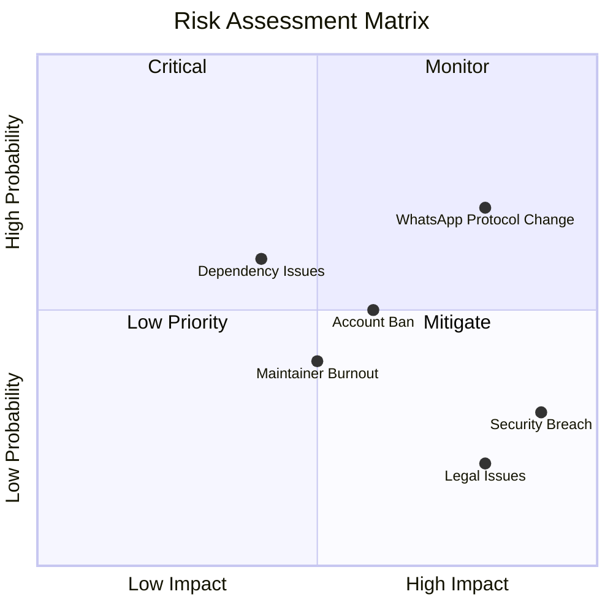

## 16.2 Risk Register

### R001: WhatsApp Protocol Changes

| Attribute | Value |
|-----------|-------|
| **ID** | R001 |
| **Category** | Technical |
| **Probability** | High (70%) |
| **Impact** | High |
| **Risk Level** | Critical |

**Description:**  
WhatsApp can change their Web protocol at any time, which can cause the `whatsapp-web.js` library to stop working.

**Indicators:**
- Spike in `whatsapp-web.js` issues
- Sudden increase in error rates
- Authentication failures

**Mitigation Strategies:**

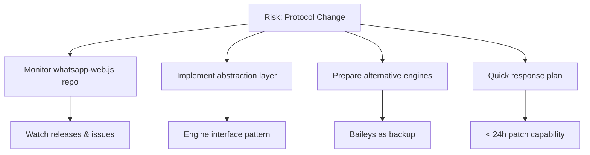

**Action Items:**
1. Subscribe to `whatsapp-web.js` releases
2. Design the engine abstraction layer
3. Document fallback procedures
4. Maintain relationships with library maintainers

---

### R002: User Account Banned

| Attribute | Value |
|-----------|-------|
| **ID** | R002 |
| **Category** | Operational |
| **Probability** | Medium (50%) |
| **Impact** | Medium |
| **Risk Level** | Medium |

**Description:**  
WhatsApp users can be banned for using unofficial APIs or behavior detected as spam.

**Indicators:**
- User reports of banned accounts
- Sudden disconnections
- QR code fails for specific numbers

**Mitigation Strategies:**

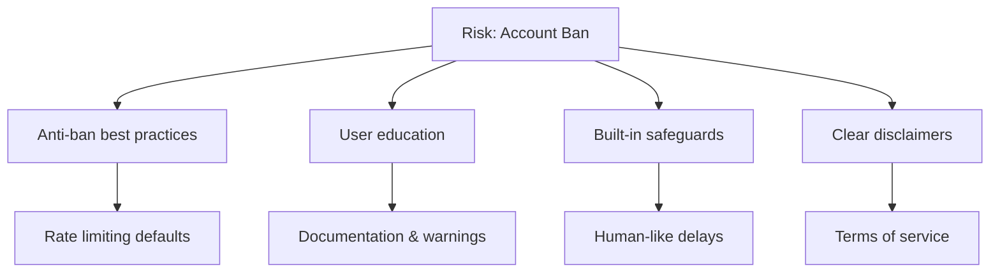

**Built-in Safeguards:**

```typescript
// Default rate limits to prevent ban
const DEFAULT_SAFEGUARDS = {
  // Message sending
  minDelayBetweenMessages: 3000,  // 3 seconds minimum
  maxMessagesPerMinute: 20,
  maxMessagesPerHour: 200,
  
  // Session behavior
  enableTypingIndicator: true,
  randomizeDelays: true,
  
  // Warnings
  warnOnBulkSend: true,
  warnOnNewNumberSpam: true,
};
```

**User Guidelines Document:**

```markdown
## Anti-Ban Best Practices

### DO ✅
- Warm up new numbers (normal usage for 1-2 weeks)
- Use realistic delays between messages
- Personalize messages (avoid identical content)
- Respond to incoming messages
- Use residential proxies if needed

### DON'T ❌
- Send bulk messages to unknown numbers
- Use identical message templates
- Send >100 messages/day on new numbers
- Ignore replies (one-way communication)
- Use datacenter IPs without proxy
```

---

### R003: Security Breach

| Attribute | Value |
|-----------|-------|
| **ID** | R003 |
| **Category** | Security |
| **Probability** | Low (30%) |
| **Impact** | Critical |
| **Risk Level** | High |

**Description:**  
Security vulnerabilities may lead to unauthorized access to sessions, data, or infrastructure.

**Potential Vectors:**
- API key leakage
- SQL injection
- Insecure session storage
- Dependency vulnerabilities

**Mitigation Strategies:**

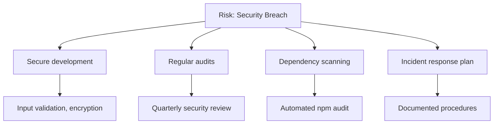

**Security Checklist:**

```markdown
## Security Review Checklist

### Code Security
- [ ] Input validation on all endpoints
- [ ] Parameterized database queries
- [ ] API key hashing (never plain storage)
- [ ] Sensitive data encryption
- [ ] No secrets in codebase

### Infrastructure Security
- [ ] HTTPS enforced
- [ ] Security headers configured
- [ ] Rate limiting enabled
- [ ] Firewall rules reviewed
- [ ] Access logs enabled

### Dependency Security
- [ ] npm audit clean
- [ ] Snyk scan passed
- [ ] Dependencies up to date
- [ ] No known vulnerabilities
```

**Incident Response Plan:**

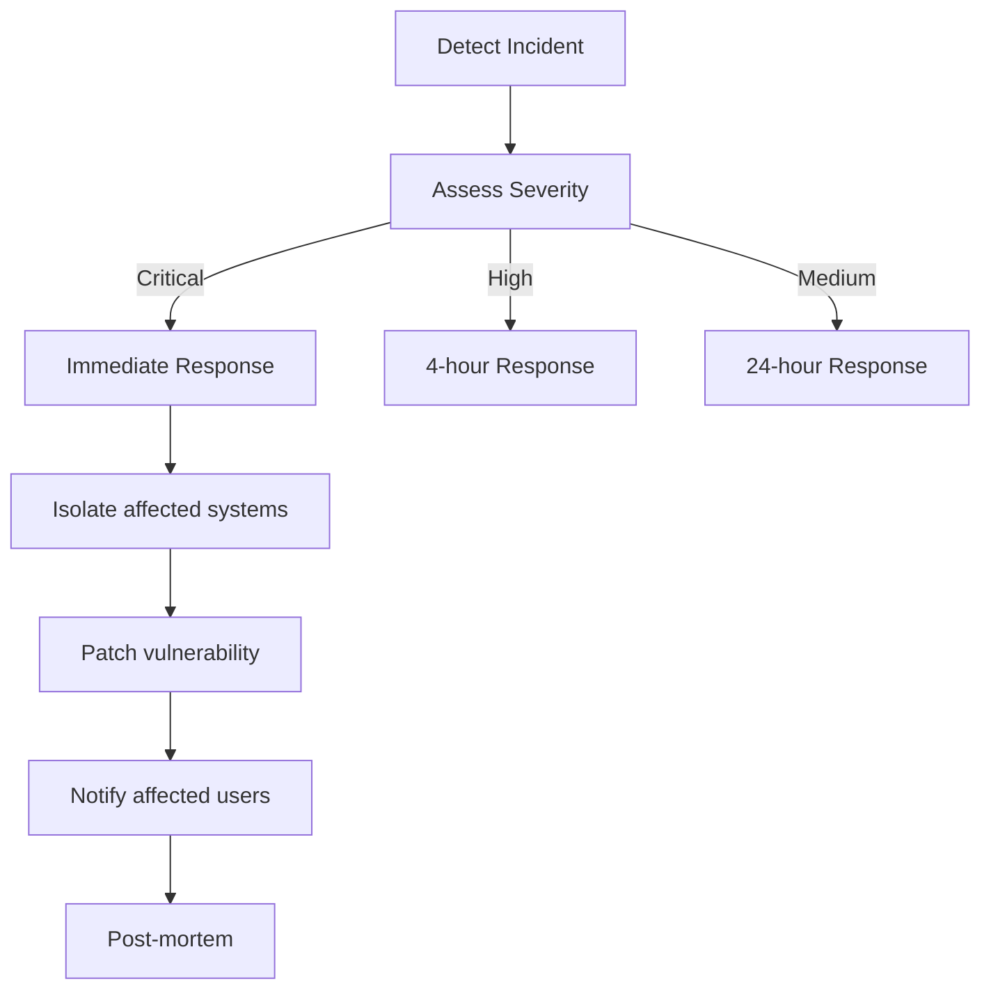

---

### R004: Maintainer Burnout

| Attribute | Value |
|-----------|-------|
| **ID** | R004 |
| **Category** | Organizational |
| **Probability** | Medium (40%) |
| **Impact** | Medium |
| **Risk Level** | Medium |

**Description:**  
An open-source project can stagnate if maintainers burn out or lack time.

**Indicators:**
- Increasing response time to issues
- PR review delays
- Reduced commit frequency
- Maintainer communication gaps

**Mitigation Strategies:**

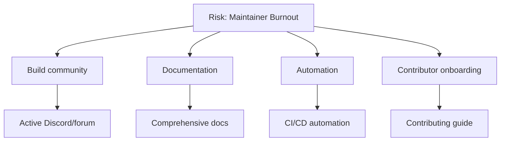

**Sustainability Measures:**

1. **Comprehensive Documentation**
   - Anyone can understand the codebase
   - Clear architecture decisions
   - Troubleshooting guides

2. **Automation**
   - Automated testing
   - Automated releases
   - Issue/PR templates

3. **Community Building**
   - Recognize contributors
   - Good first issues
   - Mentorship program

4. **Multiple Maintainers**
   - Bus factor > 1
   - Clear ownership areas
   - Succession planning

---

### R005: Dependency Vulnerabilities

| Attribute | Value |
|-----------|-------|
| **ID** | R005 |
| **Category** | Technical |
| **Probability** | High (60%) |
| **Impact** | Medium |
| **Risk Level** | Medium |

**Description:**  
Dependencies (`whatsapp-web.js`, Puppeteer, NestJS, etc.) may have vulnerabilities or breaking changes.

**Mitigation Strategies:**

```yaml
# .github/workflows/security.yml
name: Security Scan

on:
  schedule:
    - cron: '0 0 * * *'  # Daily
  push:
    branches: [main]

jobs:
  audit:
    runs-on: ubuntu-latest
    steps:
      - uses: actions/checkout@v4
      
      - name: npm audit
        run: npm audit --audit-level=high
        
      - name: Snyk scan
        uses: snyk/actions/node@master
        env:
          SNYK_TOKEN: ${{ secrets.SNYK_TOKEN }}
```

**Dependency Management Policy:**

| Action | Frequency |
|--------|-----------|
| npm audit | Daily (automated) |
| Snyk scan | Daily (automated) |
| Minor updates | Weekly |
| Major updates | Monthly (with testing) |
| Security patches | Immediate |

---

### R006: Legal/Compliance Issues

| Attribute | Value |
|-----------|-------|
| **ID** | R006 |
| **Category** | Legal |
| **Probability** | Low (20%) |
| **Impact** | Critical |
| **Risk Level** | Medium |

**Description:**  
WhatsApp/Meta may take legal action against unofficial APIs, or users may misuse the system for illegal activities.

**Mitigation Strategies:**

1. **Clear Disclaimers**

```markdown
## Disclaimer

This project is not affiliated with, authorized, maintained, 
sponsored or endorsed by WhatsApp or any of its affiliates.

This is an independent and unofficial software. Use at your own risk.

By using this software, you agree that:
1. You will not use it for spam or illegal activities
2. You are responsible for compliance with local laws
3. The maintainers are not liable for any misuse
```

2. **Terms of Service for Users**
3. **No support for spam/illegal use cases**
4. **Built-in anti-abuse measures**

---

## 16.3 Risk Monitoring

### Monitoring Dashboard

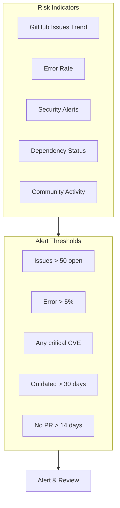

### Weekly Risk Review

```markdown
## Weekly Risk Review Template

### Date: YYYY-MM-DD

### Technical Risks
- [ ] whatsapp-web.js status: ___
- [ ] Error rate trend: ___
- [ ] Security scan results: ___
- [ ] Dependency updates needed: ___

### Operational Risks
- [ ] User ban reports: ___
- [ ] Support ticket volume: ___
- [ ] Performance issues: ___

### Community Health
- [ ] Open issues: ___
- [ ] Open PRs: ___
- [ ] New contributors: ___
- [ ] Response time (avg): ___

### Actions Needed
1. ___
2. ___
3. ___
```

## 16.4 Contingency Plans

### Plan A: WhatsApp Protocol Change

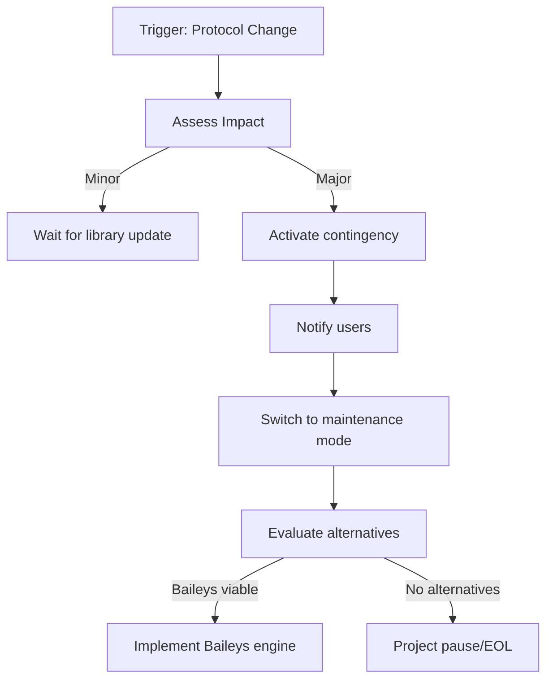

### Plan B: Critical Security Vulnerability

```
Timeline: < 24 hours response

Hour 0-1:
- Assess severity
- Disable affected features if needed
- Notify critical users

Hour 1-4:
- Develop patch
- Test patch
- Prepare release

Hour 4-8:
- Deploy patch
- Notify all users
- Monitor for issues

Hour 8-24:
- Post-mortem
- Update procedures
- Additional hardening
```

### Plan C: Project Handover

```markdown
## Project Handover Checklist

### Documentation
- [ ] Architecture documented
- [ ] All decisions logged
- [ ] Deployment procedures
- [ ] Credentials inventory

### Access
- [ ] GitHub owner transfer
- [ ] npm publish rights
- [ ] Domain ownership
- [ ] Cloud accounts

### Knowledge Transfer
- [ ] Codebase walkthrough
- [ ] Known issues list
- [ ] Roadmap handover
- [ ] Community introduction
```

## 16.5 Additional Risk Mitigations

### R007: Rate Limiting & WhatsApp Throttling

| Attribute | Value |
|-----------|-------|
| **ID** | R007 |
| **Category** | Operational |
| **Probability** | High (70%) |
| **Impact** | Medium |
| **Risk Level** | Medium |

**Description:**
WhatsApp has undocumented internal rate limits. Sending too many messages can trigger temporary blocks or permanent bans.

**Built-in Safeguards:**

```typescript
// Anti-ban configuration defaults
const RATE_LIMIT_CONFIG = {
  // Per session limits
  messagesPerMinute: 20,
  messagesPerHour: 200,
  messagesPerDay: 1000,

  // Delays
  minDelayBetweenMessages: 3000,    // 3 seconds
  maxDelayBetweenMessages: 5000,    // 5 seconds
  delayAfterMedia: 5000,            // 5 seconds after media

  // Bulk messaging
  bulkBatchSize: 50,
  bulkDelayBetweenBatches: 60000,   // 1 minute

  // New number warmup
  newNumberDailyLimit: 50,
  newNumberWarmupDays: 14,
};
```

**Monitoring Metrics:**

| Metric | Warning Threshold | Critical Threshold |
|--------|-------------------|--------------------|
| Messages per minute | > 15 | > 25 |
| Failed sends | > 5% | > 15% |
| Connection drops | > 2/hour | > 5/hour |
| QR re-auth requests | > 1/day | > 3/day |

---

### R008: Data Loss

| Attribute | Value |
|-----------|-------|
| **ID** | R008 |
| **Category** | Technical |
| **Probability** | Low (20%) |
| **Impact** | High |
| **Risk Level** | Medium |

**Mitigation Strategy:**

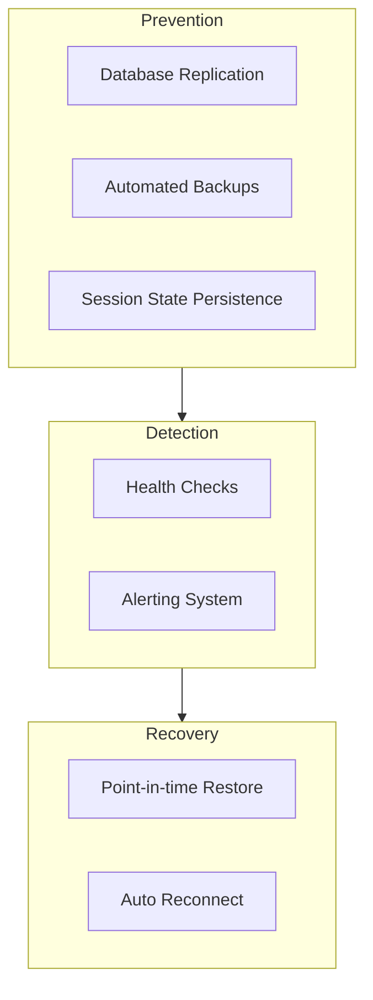

**Backup Schedule:**

| Data Type | Frequency | Retention | Storage |
|-----------|-----------|-----------|---------|
| Database (full) | Daily 02:00 | 30 days | S3/GCS |
| Database (incremental) | Every 6 hours | 7 days | S3/GCS |
| Session auth state | On change | Indefinite | Database |
| Configuration | On change | Indefinite | Git |

---

## 16.6 Escalation Procedures

### Severity Levels

| Level | Description | Response Time | Notification |
|-------|-------------|---------------|--------------|
| **P1 - Critical** | System down, data breach | < 15 minutes | Phone + Slack |
| **P2 - High** | Major feature broken | < 1 hour | Slack + Email |
| **P3 - Medium** | Feature degraded | < 4 hours | Slack |
| **P4 - Low** | Minor issue | < 24 hours | GitHub Issue |

### Escalation Flow

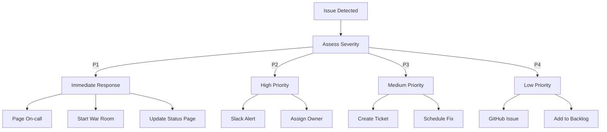

### On-Call Rotation

```yaml
# Example PagerDuty/Opsgenie configuration
schedule:
  name: "OpenWA On-Call"
  rotation:
    - week: 1
      primary: "developer-a"
      secondary: "developer-b"
    - week: 2
      primary: "developer-b"
      secondary: "developer-a"

escalation:
  - level: 1
    wait: 5m
    target: primary
  - level: 2
    wait: 10m
    target: secondary
  - level: 3
    wait: 15m
    target: all-team
```

---

## 16.7 Risk Dashboard

### Key Risk Indicators (KRI)

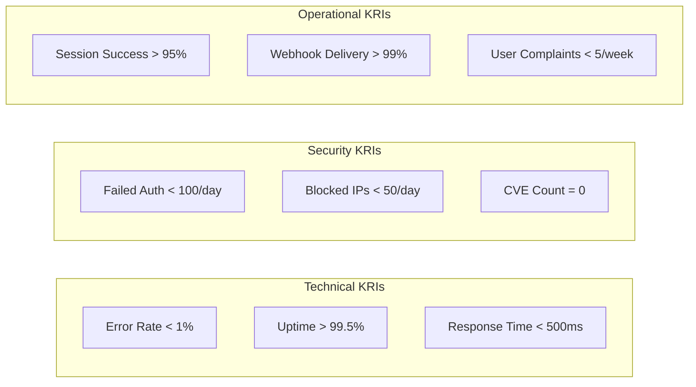

### Weekly Risk Report Template

```markdown
## Weekly Risk Report - Week XX

### Summary
- Overall Risk Status: 🟢 Green / 🟡 Yellow / 🔴 Red
- New Risks Identified: X
- Risks Mitigated: X
- Active Incidents: X

### KRI Status

| KRI | Target | Actual | Status |
|-----|--------|--------|--------|
| Error Rate | < 1% | X.XX% | 🟢/🟡/🔴 |
| Uptime | > 99.5% | XX.XX% | 🟢/🟡/🔴 |
| Response Time | < 500ms | XXXms | 🟢/🟡/🔴 |

### Top Risks This Week

1. **Risk Name**
   - Status: Monitoring/Mitigating/Resolved
   - Action: [Description]

### Dependencies Update

| Dependency | Current | Latest | CVEs | Action |
|------------|---------|--------|------|--------|
| whatsapp-web.js | X.X.X | X.X.X | 0 | OK |
| puppeteer | X.X.X | X.X.X | 0 | OK |

### Action Items
- [ ] Action 1
- [ ] Action 2
```

---

## 16.8 Risk Summary

| ID | Risk | Probability | Impact | Level | Status |
|----|------|-------------|--------|-------|--------|
| R001 | Protocol Changes | High | High | 🔴 Critical | Monitoring |
| R002 | Account Ban | Medium | Medium | 🟡 Medium | Mitigated |
| R003 | Security Breach | Low | Critical | 🟡 Medium | Mitigated |
| R004 | Maintainer Burnout | Medium | Medium | 🟡 Medium | Planning |
| R005 | Dependency Issues | High | Medium | 🟡 Medium | Automated |
| R006 | Legal Issues | Low | Critical | 🟡 Medium | Mitigated |
| R007 | Rate Limiting | High | Medium | 🟡 Medium | Mitigated |
| R008 | Data Loss | Low | High | 🟡 Medium | Mitigated |

### Risk Trend

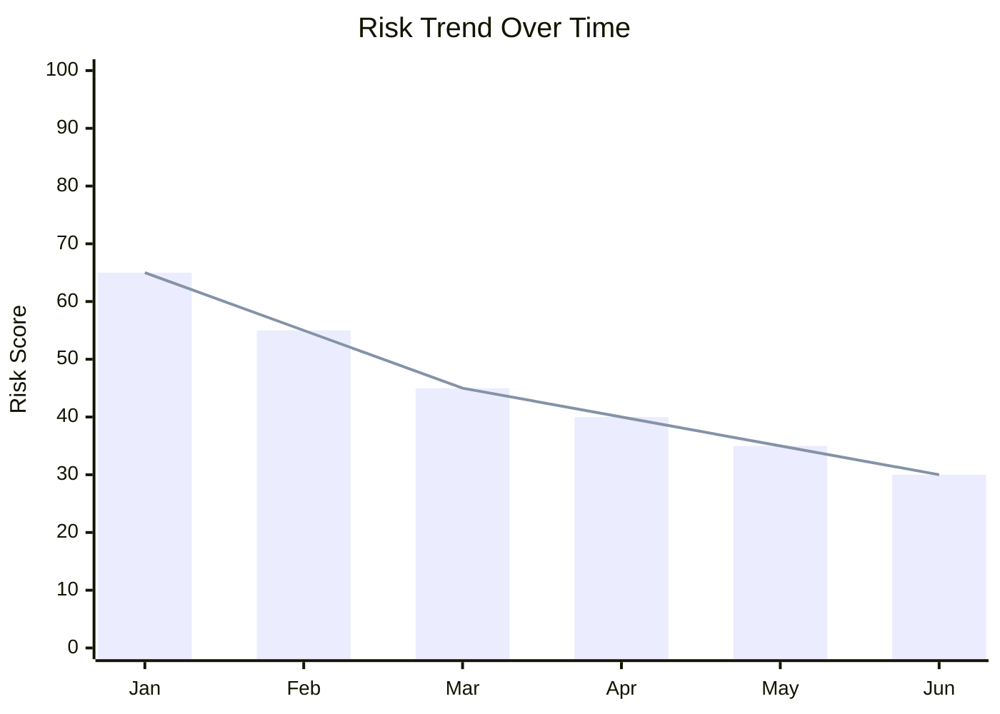
---

<div align="center">

[← 15 - Project Roadmap](./15-project-roadmap.md) · [Documentation Index](./README.md) · [Next: 17 - Dashboard Design →](./17-dashboard-design.md)

</div>
