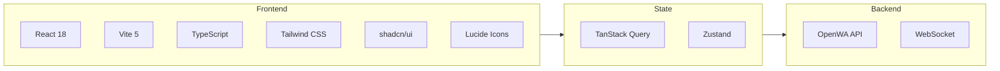
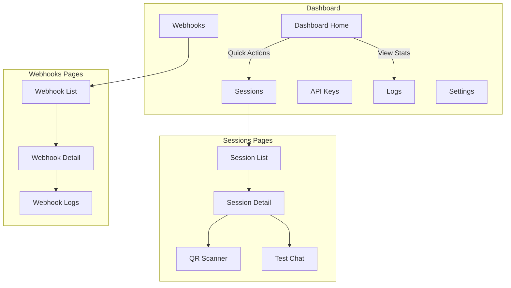

# 17 - Dashboard Design

## 17.1 Overview

The dashboard is a web-based management interface for OpenWA that lets users manage sessions, webhooks, and monitor activity without using the API directly.

### Tech Stack



### Design Principles

1. **Minimalist** - Clean, uncluttered interface
2. **Responsive** - Works on desktop and mobile
3. **Real-time** - Live updates via WebSocket
4. **Accessible** - WCAG 2.1 AA compliant
5. **Dark mode** - Support for light/dark themes

## 17.2 Information Architecture



### Navigation Structure

```
/                       → Dashboard Home
/sessions               → Session List
/sessions/:id           → Session Detail
/sessions/:id/chat      → Test Chat Interface
/webhooks               → Webhook List
/webhooks/:id           → Webhook Detail
/api-keys               → API Keys Management
/logs                   → Activity Logs
/settings               → Settings
/settings/profile       → Profile Settings
/settings/appearance    → Theme Settings
```

## 17.3 Wireframes

### Dashboard Home

```
┌─────────────────────────────────────────────────────────────────────┐
│  🔵 OpenWA                              🔍 Search    👤 Admin    ☀️  │
├─────────────────────────────────────────────────────────────────────┤
│                                                                      │
│  ┌─────────────┬─────────────┬─────────────┬─────────────┐          │
│  │   📱 5      │   ✅ 4      │   📨 1,234  │   🔗 3      │          │
│  │  Sessions   │  Connected  │   Messages  │  Webhooks   │          │
│  │             │             │   (Today)   │   Active    │          │
│  └─────────────┴─────────────┴─────────────┴─────────────┘          │
│                                                                      │
│  ┌──────────────────────────────────┐ ┌────────────────────────┐    │
│  │  Sessions Overview               │ │  Recent Activity       │    │
│  │  ┌──────┬──────┬──────┬──────┐  │ │                        │    │
│  │  │ 🟢   │ 🟢   │ 🟢   │ 🟡   │  │ │  10:30 Message sent    │    │
│  │  │ CS-1 │ CS-2 │ Sales│ Supp │  │ │  10:28 Webhook called  │    │
│  │  │ 123  │ 456  │  789 │  -   │  │ │  10:25 Session online  │    │
│  │  └──────┴──────┴──────┴──────┘  │ │  10:20 Message recv    │    │
│  │                                  │ │  10:15 QR scanned      │    │
│  │  [+ New Session]                 │ │                        │    │
│  └──────────────────────────────────┘ │  [View All →]          │    │
│                                        └────────────────────────┘    │
│                                                                      │
│  ┌──────────────────────────────────────────────────────────────┐   │
│  │  Message Volume (Last 7 Days)                                 │   │
│  │  ┌────────────────────────────────────────────────────────┐  │   │
│  │  │    ▓▓                                                   │  │   │
│  │  │    ▓▓     ▓▓                      ▓▓                   │  │   │
│  │  │    ▓▓     ▓▓  ▓▓            ▓▓    ▓▓                   │  │   │
│  │  │ ▓▓▓▓  ▓▓  ▓▓  ▓▓  ▓▓  ▓▓  ▓▓    ▓▓  ▓▓               │  │   │
│  │  │ Mon   Tue Wed Thu Fri  Sat Sun                         │  │   │
│  │  └────────────────────────────────────────────────────────┘  │   │
│  └──────────────────────────────────────────────────────────────┘   │
│                                                                      │
└─────────────────────────────────────────────────────────────────────┘
```

### Session List

```
┌─────────────────────────────────────────────────────────────────────┐
│  ← Sessions                                        [+ New Session]   │
├─────────────────────────────────────────────────────────────────────┤
│                                                                      │
│  🔍 Search sessions...              Filter: [All ▾] [Status ▾]      │
│                                                                      │
│  ┌───────────────────────────────────────────────────────────────┐  │
│  │ ● Customer Support 1                              🟢 Connected │  │
│  │   📱 +62 812-3456-789                                          │  │
│  │   📨 1,234 messages | Last active: 2 min ago                   │  │
│  │   ─────────────────────────────────────────────────────────── │  │
│  │   [📷 QR] [💬 Test Chat] [⚙️ Settings] [🗑️ Delete]             │  │
│  └───────────────────────────────────────────────────────────────┘  │
│                                                                      │
│  ┌───────────────────────────────────────────────────────────────┐  │
│  │ ● Sales Bot                                       🟢 Connected │  │
│  │   📱 +62 821-9876-543                                          │  │
│  │   📨 567 messages | Last active: 5 min ago                     │  │
│  │   ─────────────────────────────────────────────────────────── │  │
│  │   [📷 QR] [💬 Test Chat] [⚙️ Settings] [🗑️ Delete]             │  │
│  └───────────────────────────────────────────────────────────────┘  │
│                                                                      │
│  ┌───────────────────────────────────────────────────────────────┐  │
│  │ ○ Support Backup                              🟡 Disconnected  │  │
│  │   📱 Not connected                                             │  │
│  │   📨 0 messages | Never active                                 │  │
│  │   ─────────────────────────────────────────────────────────── │  │
│  │   [📷 Scan QR] [⚙️ Settings] [🗑️ Delete]                       │  │
│  └───────────────────────────────────────────────────────────────┘  │
│                                                                      │
│  ────────────────────────────────────────────────────────────────   │
│  Showing 3 of 3 sessions                              [◀] 1 [▶]     │
│                                                                      │
└─────────────────────────────────────────────────────────────────────┘
```

### Session Detail

```
┌─────────────────────────────────────────────────────────────────────┐
│  ← Sessions / Customer Support 1                    🟢 Connected     │
├─────────────────────────────────────────────────────────────────────┤
│                                                                      │
│  ┌─────────────────────────────────────────────────────────────┐    │
│  │  ┌─────────┐                                                │    │
│  │  │  👤     │  Customer Support 1                            │    │
│  │  │ Avatar  │  +62 812-3456-789                              │    │
│  │  │         │  Status: 🟢 Connected                          │    │
│  │  └─────────┘  Platform: Android                             │    │
│  │                                                              │    │
│  │  [Restart Session] [Logout] [Delete]                        │    │
│  └─────────────────────────────────────────────────────────────┘    │
│                                                                      │
│  ┌─────────────────────┬─────────────────────┐                      │
│  │  📊 Statistics      │  ⚙️ Configuration    │                      │
│  ├─────────────────────┼─────────────────────┤                      │
│  │                     │                     │                      │
│  │  Messages Sent      │  Auto Reconnect     │                      │
│  │  ████████░░ 1,234   │  [✓] Enabled        │                      │
│  │                     │                     │                      │
│  │  Messages Received  │  Webhook URL        │                      │
│  │  ██████████ 2,567   │  https://...        │                      │
│  │                     │                     │                      │
│  │  Webhook Calls      │  Proxy              │                      │
│  │  ███████░░░   890   │  None               │                      │
│  │                     │                     │                      │
│  │  Uptime             │  Created            │                      │
│  │  99.9% (30 days)    │  2026-01-15         │                      │
│  │                     │                     │                      │
│  └─────────────────────┴─────────────────────┘                      │
│                                                                      │
│  ┌─────────────────────────────────────────────────────────────┐    │
│  │  Recent Messages                          [View All →]      │    │
│  │  ───────────────────────────────────────────────────────── │    │
│  │  → +62 821... | Hello, how can I help?     | 10:30 ✓✓      │    │
│  │  ← +62 821... | I need product info        | 10:28          │    │
│  │  → +62 821... | Sure! Here's our catalog   | 10:25 ✓✓      │    │
│  │  ← +62 813... | Thanks for your help!      | 10:20          │    │
│  └─────────────────────────────────────────────────────────────┘    │
│                                                                      │
│  [💬 Open Test Chat]                                                 │
│                                                                      │
└─────────────────────────────────────────────────────────────────────┘
```

### QR Code Scanner

```
┌─────────────────────────────────────────────────────────────────────┐
│                          Scan QR Code                                │
├─────────────────────────────────────────────────────────────────────┤
│                                                                      │
│                    ┌─────────────────────────┐                       │
│                    │                         │                       │
│                    │   ████████████████████  │                       │
│                    │   ██              ████  │                       │
│                    │   ██  ██████████  ████  │                       │
│                    │   ██  ██      ██  ████  │                       │
│                    │   ██  ██      ██  ████  │                       │
│                    │   ██  ██      ██  ████  │                       │
│                    │   ██  ██████████  ████  │                       │
│                    │   ██              ████  │                       │
│                    │   ████████████████████  │                       │
│                    │                         │                       │
│                    └─────────────────────────┘                       │
│                                                                      │
│                    Expires in: 0:45                                  │
│                                                                      │
│     ──────────────────────────────────────────────────────          │
│                                                                      │
│     1. Open WhatsApp on your phone                                   │
│     2. Tap Menu ⋮ or Settings ⚙                                     │
│     3. Tap Linked Devices                                            │
│     4. Tap Link a Device                                             │
│     5. Point your phone at this screen                               │
│                                                                      │
│     ──────────────────────────────────────────────────────          │
│                                                                      │
│                    [Refresh QR] [Cancel]                             │
│                                                                      │
└─────────────────────────────────────────────────────────────────────┘
```

### Test Chat Interface

```
┌─────────────────────────────────────────────────────────────────────┐
│  ← Test Chat                              Session: Customer Support  │
├─────────────────────────────────────────────────────────────────────┤
│                                                                      │
│  ┌──────────────────────┐ ┌────────────────────────────────────┐    │
│  │  Contacts            │ │  +62 821-9876-543                  │    │
│  │  ──────────────────  │ │  John Doe                          │    │
│  │                      │ ├────────────────────────────────────┤    │
│  │  🔍 Search...        │ │                                    │    │
│  │                      │ │  ┌──────────────────────────────┐ │    │
│  │  ┌────────────────┐  │ │  │ Hello! How can I help you?  │ │    │
│  │  │ 👤 John Doe    │  │ │  │                    10:30 ✓✓ │ │    │
│  │  │    Last: Hi!   │  │ │  └──────────────────────────────┘ │    │
│  │  └────────────────┘  │ │                                    │    │
│  │                      │ │      ┌─────────────────────────┐   │    │
│  │  ┌────────────────┐  │ │      │ I need help with my    │   │    │
│  │  │ 👤 Jane Smith  │  │ │      │ order #12345           │   │    │
│  │  │    Last: OK    │  │ │      │              10:31     │   │    │
│  │  └────────────────┘  │ │      └─────────────────────────┘   │    │
│  │                      │ │                                    │    │
│  │  ┌────────────────┐  │ │  ┌──────────────────────────────┐ │    │
│  │  │ 👤 Bob Wilson  │  │ │  │ Sure! Let me check that    │ │    │
│  │  │    Last: Thx   │  │ │  │ for you. One moment...     │ │    │
│  │  └────────────────┘  │ │  │                    10:32 ✓✓ │ │    │
│  │                      │ │  └──────────────────────────────┘ │    │
│  │                      │ │                                    │    │
│  │  ──────────────────  │ ├────────────────────────────────────┤    │
│  │  [+ New Chat]        │ │  📎 [                        ] 📤  │    │
│  └──────────────────────┘ │     Type a message...              │    │
│                           └────────────────────────────────────┘    │
│                                                                      │
└─────────────────────────────────────────────────────────────────────┘
```

### Webhook Management

```
┌─────────────────────────────────────────────────────────────────────┐
│  ← Webhooks                                      [+ New Webhook]     │
├─────────────────────────────────────────────────────────────────────┤
│                                                                      │
│  ┌───────────────────────────────────────────────────────────────┐  │
│  │  🔗 Main Webhook                                   ✅ Active   │  │
│  │  https://api.example.com/webhook/openwa                        │  │
│  │  Events: message.received, message.ack, session.status         │  │
│  │  Sessions: All                                                 │  │
│  │  ──────────────────────────────────────────────────────────── │  │
│  │  Success Rate: 99.8% | Avg Latency: 125ms | Last: 2 min ago   │  │
│  │  [Test] [View Logs] [Edit] [Disable]                          │  │
│  └───────────────────────────────────────────────────────────────┘  │
│                                                                      │
│  ┌───────────────────────────────────────────────────────────────┐  │
│  │  🔗 Analytics Webhook                              ✅ Active   │  │
│  │  https://analytics.example.com/track                           │  │
│  │  Events: message.received                                      │  │
│  │  Sessions: cs-1, sales                                         │  │
│  │  ──────────────────────────────────────────────────────────── │  │
│  │  Success Rate: 100% | Avg Latency: 89ms | Last: 5 min ago     │  │
│  │  [Test] [View Logs] [Edit] [Disable]                          │  │
│  └───────────────────────────────────────────────────────────────┘  │
│                                                                      │
│  ┌───────────────────────────────────────────────────────────────┐  │
│  │  🔗 Backup Webhook                              ⏸️ Disabled    │  │
│  │  https://backup.example.com/wa                                 │  │
│  │  Events: message.received, message.ack                         │  │
│  │  Sessions: All                                                 │  │
│  │  ──────────────────────────────────────────────────────────── │  │
│  │  [Enable] [Edit] [Delete]                                     │  │
│  └───────────────────────────────────────────────────────────────┘  │
│                                                                      │
└─────────────────────────────────────────────────────────────────────┘
```

## 17.4 Component Library

### Using shadcn/ui

```bash
# Initialize shadcn/ui
npx shadcn-ui@latest init

# Add components
npx shadcn-ui@latest add button
npx shadcn-ui@latest add card
npx shadcn-ui@latest add dialog
npx shadcn-ui@latest add dropdown-menu
npx shadcn-ui@latest add input
npx shadcn-ui@latest add table
npx shadcn-ui@latest add tabs
npx shadcn-ui@latest add toast
npx shadcn-ui@latest add avatar
npx shadcn-ui@latest add badge
npx shadcn-ui@latest add skeleton
```

### Custom Components

```typescript
// components/ui/status-badge.tsx

import { Badge } from '@/components/ui/badge';
import { cn } from '@/lib/utils';

type SessionStatus = 'CONNECTED' | 'DISCONNECTED' | 'INITIALIZING' | 'SCAN_QR';

interface StatusBadgeProps {
  status: SessionStatus;
  className?: string;
}

const statusConfig: Record<SessionStatus, { label: string; variant: string; dot: string }> = {
  CONNECTED: {
    label: 'Connected',
    variant: 'success',
    dot: 'bg-green-500',
  },
  DISCONNECTED: {
    label: 'Disconnected',
    variant: 'destructive',
    dot: 'bg-red-500',
  },
  INITIALIZING: {
    label: 'Initializing',
    variant: 'warning',
    dot: 'bg-yellow-500',
  },
  SCAN_QR: {
    label: 'Scan QR',
    variant: 'secondary',
    dot: 'bg-blue-500 animate-pulse',
  },
};

export function StatusBadge({ status, className }: StatusBadgeProps) {
  const config = statusConfig[status];

  return (
    <Badge variant={config.variant as any} className={cn('gap-1.5', className)}>
      <span className={cn('h-2 w-2 rounded-full', config.dot)} />
      {config.label}
    </Badge>
  );
}
```

```typescript
// components/ui/session-card.tsx

import { Card, CardContent, CardFooter, CardHeader } from '@/components/ui/card';
import { Avatar, AvatarFallback, AvatarImage } from '@/components/ui/avatar';
import { Button } from '@/components/ui/button';
import { StatusBadge } from '@/components/ui/status-badge';
import { MessageSquare, QrCode, Settings, Trash2 } from 'lucide-react';
import { Session } from '@/types';
import { formatDistanceToNow } from 'date-fns';

interface SessionCardProps {
  session: Session;
  onQr: () => void;
  onChat: () => void;
  onSettings: () => void;
  onDelete: () => void;
}

export function SessionCard({
  session,
  onQr,
  onChat,
  onSettings,
  onDelete,
}: SessionCardProps) {
  return (
    <Card>
      <CardHeader className="flex flex-row items-center gap-4">
        <Avatar className="h-12 w-12">
          <AvatarImage src={session.profilePicture} />
          <AvatarFallback>
            {session.name.slice(0, 2).toUpperCase()}
          </AvatarFallback>
        </Avatar>
        <div className="flex-1">
          <div className="flex items-center justify-between">
            <h3 className="font-semibold">{session.name}</h3>
            <StatusBadge status={session.status} />
          </div>
          <p className="text-sm text-muted-foreground">
            {session.phoneNumber || 'Not connected'}
          </p>
        </div>
      </CardHeader>

      <CardContent>
        <div className="flex justify-between text-sm text-muted-foreground">
          <span>{session.stats?.messagesSent || 0} messages</span>
          <span>
            {session.lastSeen
              ? `Active ${formatDistanceToNow(new Date(session.lastSeen))} ago`
              : 'Never active'}
          </span>
        </div>
      </CardContent>

      <CardFooter className="gap-2">
        {session.status === 'CONNECTED' ? (
          <>
            <Button variant="outline" size="sm" onClick={onChat}>
              <MessageSquare className="mr-2 h-4 w-4" />
              Chat
            </Button>
          </>
        ) : (
          <Button variant="outline" size="sm" onClick={onQr}>
            <QrCode className="mr-2 h-4 w-4" />
            Scan QR
          </Button>
        )}
        <Button variant="ghost" size="sm" onClick={onSettings}>
          <Settings className="h-4 w-4" />
        </Button>
        <Button variant="ghost" size="sm" onClick={onDelete}>
          <Trash2 className="h-4 w-4 text-destructive" />
        </Button>
      </CardFooter>
    </Card>
  );
}
```

```typescript
// components/ui/qr-code-display.tsx

import { useEffect, useState } from 'react';
import { Card, CardContent } from '@/components/ui/card';
import { Button } from '@/components/ui/button';
import { Skeleton } from '@/components/ui/skeleton';
import { RefreshCw } from 'lucide-react';
import QRCode from 'qrcode';

interface QrCodeDisplayProps {
  qrData: string | null;
  expiresAt: string | null;
  onRefresh: () => void;
  isLoading: boolean;
}

export function QrCodeDisplay({
  qrData,
  expiresAt,
  onRefresh,
  isLoading,
}: QrCodeDisplayProps) {
  const [qrImage, setQrImage] = useState<string | null>(null);
  const [countdown, setCountdown] = useState<number>(0);

  useEffect(() => {
    if (qrData) {
      QRCode.toDataURL(qrData, {
        width: 256,
        margin: 2,
        color: {
          dark: '#000000',
          light: '#ffffff',
        },
      }).then(setQrImage);
    }
  }, [qrData]);

  useEffect(() => {
    if (expiresAt) {
      const interval = setInterval(() => {
        const remaining = Math.max(
          0,
          Math.floor((new Date(expiresAt).getTime() - Date.now()) / 1000)
        );
        setCountdown(remaining);

        if (remaining === 0) {
          clearInterval(interval);
        }
      }, 1000);

      return () => clearInterval(interval);
    }
  }, [expiresAt]);

  return (
    <Card className="w-fit mx-auto">
      <CardContent className="pt-6 text-center">
        {isLoading ? (
          <Skeleton className="h-64 w-64 mx-auto" />
        ) : qrImage ? (
          <>
            
            <p className="mt-4 text-sm text-muted-foreground">
              Expires in: {Math.floor(countdown / 60)}:
              {(countdown % 60).toString().padStart(2, '0')}
            </p>
          </>
        ) : (
          <div className="h-64 w-64 flex items-center justify-center bg-muted rounded-lg">
            <p className="text-muted-foreground">QR Code expired</p>
          </div>
        )}

        <Button
          variant="outline"
          className="mt-4"
          onClick={onRefresh}
          disabled={isLoading}
        >
          <RefreshCw className={`mr-2 h-4 w-4 ${isLoading ? 'animate-spin' : ''}`} />
          Refresh QR
        </Button>
      </CardContent>
    </Card>
  );
}
```

## 17.5 State Management

### Zustand Store

```typescript
// stores/session-store.ts

import { create } from 'zustand';
import { Session } from '@/types';

interface SessionState {
  sessions: Session[];
  selectedSession: Session | null;
  isLoading: boolean;
  error: string | null;

  // Actions
  setSessions: (sessions: Session[]) => void;
  addSession: (session: Session) => void;
  updateSession: (id: string, updates: Partial<Session>) => void;
  removeSession: (id: string) => void;
  selectSession: (session: Session | null) => void;
  setLoading: (loading: boolean) => void;
  setError: (error: string | null) => void;
}

export const useSessionStore = create<SessionState>((set) => ({
  sessions: [],
  selectedSession: null,
  isLoading: false,
  error: null,

  setSessions: (sessions) => set({ sessions }),

  addSession: (session) =>
    set((state) => ({
      sessions: [...state.sessions, session],
    })),

  updateSession: (id, updates) =>
    set((state) => ({
      sessions: state.sessions.map((s) =>
        s.id === id ? { ...s, ...updates } : s
      ),
      selectedSession:
        state.selectedSession?.id === id
          ? { ...state.selectedSession, ...updates }
          : state.selectedSession,
    })),

  removeSession: (id) =>
    set((state) => ({
      sessions: state.sessions.filter((s) => s.id !== id),
      selectedSession:
        state.selectedSession?.id === id ? null : state.selectedSession,
    })),

  selectSession: (session) => set({ selectedSession: session }),

  setLoading: (isLoading) => set({ isLoading }),

  setError: (error) => set({ error }),
}));
```

### TanStack Query Hooks

```typescript
// hooks/use-sessions.ts

import { useQuery, useMutation, useQueryClient } from '@tanstack/react-query';
import { api } from '@/lib/api';
import { Session, CreateSessionInput } from '@/types';
import { useSessionStore } from '@/stores/session-store';

export function useSessions() {
  const { setSessions, setError } = useSessionStore();

  return useQuery({
    queryKey: ['sessions'],
    queryFn: async () => {
      const response = await api.get<{ data: Session[] }>('/api/sessions');
      return response.data.data;
    },
    onSuccess: (data) => {
      setSessions(data);
    },
    onError: (error: Error) => {
      setError(error.message);
    },
  });
}

export function useSession(id: string) {
  return useQuery({
    queryKey: ['sessions', id],
    queryFn: async () => {
      const response = await api.get<{ data: Session }>(`/api/sessions/${id}`);
      return response.data.data;
    },
    enabled: !!id,
  });
}

export function useCreateSession() {
  const queryClient = useQueryClient();
  const { addSession } = useSessionStore();

  return useMutation({
    mutationFn: async (input: CreateSessionInput) => {
      const response = await api.post<{ data: Session }>('/api/sessions', input);
      return response.data.data;
    },
    onSuccess: (data) => {
      addSession(data);
      queryClient.invalidateQueries({ queryKey: ['sessions'] });
    },
  });
}

export function useDeleteSession() {
  const queryClient = useQueryClient();
  const { removeSession } = useSessionStore();

  return useMutation({
    mutationFn: async (id: string) => {
      await api.delete(`/api/sessions/${id}`);
      return id;
    },
    onSuccess: (id) => {
      removeSession(id);
      queryClient.invalidateQueries({ queryKey: ['sessions'] });
    },
  });
}

export function useSessionQr(id: string) {
  return useQuery({
    queryKey: ['sessions', id, 'qr'],
    queryFn: async () => {
      const response = await api.get<{ data: { qr: string; expiresAt: string } }>(
        `/api/sessions/${id}/qr`
      );
      return response.data.data;
    },
    enabled: !!id,
    refetchInterval: 30000, // Refresh every 30 seconds
  });
}
```

## 17.6 WebSocket Integration

```typescript
// lib/websocket.ts

import { useEffect, useRef, useCallback } from 'react';
import { useSessionStore } from '@/stores/session-store';

type EventType =
  | 'session.status'
  | 'session.qr'
  | 'message.received'
  | 'message.ack'
  | 'session.authenticated'
  | 'session.disconnected';

interface WebSocketMessage {
  event: EventType;
  sessionId: string;
  data: any;
}

export function useWebSocket(apiKey: string) {
  const ws = useRef<WebSocket | null>(null);
  const { updateSession } = useSessionStore();

  const connect = useCallback(() => {
    const wsUrl = `${import.meta.env.VITE_WS_URL || 'ws://localhost:2785'}/ws?apiKey=${apiKey}`;
    ws.current = new WebSocket(wsUrl);

    ws.current.onopen = () => {
      console.log('WebSocket connected');
    };

    ws.current.onmessage = (event) => {
      const message: WebSocketMessage = JSON.parse(event.data);

      switch (message.event) {
        case 'session.status':
          updateSession(message.sessionId, {
            status: message.data.status,
          });
          break;

        case 'session.authenticated':
          updateSession(message.sessionId, {
            status: 'CONNECTED',
            phoneNumber: message.data.phoneNumber,
            profileName: message.data.profileName,
          });
          break;

        case 'session.disconnected':
          updateSession(message.sessionId, {
            status: 'DISCONNECTED',
          });
          break;

        case 'session.qr':
          // Handle QR update via query invalidation
          break;

        default:
          console.log('Unknown event:', message.event);
      }
    };

    ws.current.onclose = () => {
      console.log('WebSocket disconnected, reconnecting...');
      setTimeout(connect, 3000);
    };

    ws.current.onerror = (error) => {
      console.error('WebSocket error:', error);
    };
  }, [apiKey, updateSession]);

  useEffect(() => {
    connect();

    return () => {
      ws.current?.close();
    };
  }, [connect]);

  const send = useCallback((event: string, data: any) => {
    if (ws.current?.readyState === WebSocket.OPEN) {
      ws.current.send(JSON.stringify({ event, data }));
    }
  }, []);

  return { send };
}
```

## 17.7 Theme Configuration

```typescript
// lib/theme.ts

export const themes = {
  light: {
    background: '0 0% 100%',
    foreground: '222.2 84% 4.9%',
    card: '0 0% 100%',
    'card-foreground': '222.2 84% 4.9%',
    primary: '222.2 47.4% 11.2%',
    'primary-foreground': '210 40% 98%',
    secondary: '210 40% 96.1%',
    'secondary-foreground': '222.2 47.4% 11.2%',
    muted: '210 40% 96.1%',
    'muted-foreground': '215.4 16.3% 46.9%',
    accent: '210 40% 96.1%',
    'accent-foreground': '222.2 47.4% 11.2%',
    destructive: '0 84.2% 60.2%',
    'destructive-foreground': '210 40% 98%',
    border: '214.3 31.8% 91.4%',
    input: '214.3 31.8% 91.4%',
    ring: '222.2 84% 4.9%',
  },
  dark: {
    background: '222.2 84% 4.9%',
    foreground: '210 40% 98%',
    card: '222.2 84% 4.9%',
    'card-foreground': '210 40% 98%',
    primary: '210 40% 98%',
    'primary-foreground': '222.2 47.4% 11.2%',
    secondary: '217.2 32.6% 17.5%',
    'secondary-foreground': '210 40% 98%',
    muted: '217.2 32.6% 17.5%',
    'muted-foreground': '215 20.2% 65.1%',
    accent: '217.2 32.6% 17.5%',
    'accent-foreground': '210 40% 98%',
    destructive: '0 62.8% 30.6%',
    'destructive-foreground': '210 40% 98%',
    border: '217.2 32.6% 17.5%',
    input: '217.2 32.6% 17.5%',
    ring: '212.7 26.8% 83.9%',
  },
};

// Theme provider component
// components/theme-provider.tsx

import { createContext, useContext, useEffect, useState } from 'react';

type Theme = 'light' | 'dark' | 'system';

interface ThemeContextType {
  theme: Theme;
  setTheme: (theme: Theme) => void;
}

const ThemeContext = createContext<ThemeContextType | undefined>(undefined);

export function ThemeProvider({ children }: { children: React.ReactNode }) {
  const [theme, setTheme] = useState<Theme>(() => {
    const stored = localStorage.getItem('theme') as Theme;
    return stored || 'system';
  });

  useEffect(() => {
    const root = document.documentElement;

    root.classList.remove('light', 'dark');

    if (theme === 'system') {
      const systemTheme = window.matchMedia('(prefers-color-scheme: dark)').matches
        ? 'dark'
        : 'light';
      root.classList.add(systemTheme);
    } else {
      root.classList.add(theme);
    }

    localStorage.setItem('theme', theme);
  }, [theme]);

  return (
    <ThemeContext.Provider value={{ theme, setTheme }}>
      {children}
    </ThemeContext.Provider>
  );
}

export function useTheme() {
  const context = useContext(ThemeContext);
  if (!context) {
    throw new Error('useTheme must be used within a ThemeProvider');
  }
  return context;
}
```

## 17.8 Build & Deployment

### Vite Configuration

```typescript
// vite.config.ts

import { defineConfig } from 'vite';
import react from '@vitejs/plugin-react';
import path from 'path';

export default defineConfig({
  plugins: [react()],
  resolve: {
    alias: {
      '@': path.resolve(__dirname, './src'),
    },
  },
  server: {
    port: 2886,
    proxy: {
      '/api': {
        target: 'http://localhost:2785',
        changeOrigin: true,
      },
      '/ws': {
        target: 'ws://localhost:2785',
        ws: true,
      },
    },
  },
  build: {
    outDir: 'dist',
    sourcemap: true,
    rollupOptions: {
      output: {
        manualChunks: {
          vendor: ['react', 'react-dom', 'react-router-dom'],
          ui: ['@radix-ui/react-dialog', '@radix-ui/react-dropdown-menu'],
        },
      },
    },
  },
});
```

### Docker Build

```dockerfile
# dashboard/Dockerfile

# Build stage
FROM node:20-alpine AS builder

WORKDIR /app

COPY package*.json ./
RUN npm ci

COPY . .
RUN npm run build

# Production stage
FROM nginx:alpine

COPY --from=builder /app/dist /usr/share/nginx/html
COPY nginx.conf /etc/nginx/conf.d/default.conf

EXPOSE 80

CMD ["nginx", "-g", "daemon off;"]
```

```nginx
# dashboard/nginx.conf

server {
    listen 80;
    server_name _;
    root /usr/share/nginx/html;
    index index.html;

    # Gzip compression
    gzip on;
    gzip_types text/plain text/css application/json application/javascript;

    # SPA routing
    location / {
        try_files $uri $uri/ /index.html;
    }

    # API proxy (if needed)
    location /api {
        proxy_pass http://openwa:2785;
        proxy_http_version 1.1;
        proxy_set_header Upgrade $http_upgrade;
        proxy_set_header Connection 'upgrade';
        proxy_set_header Host $host;
        proxy_cache_bypass $http_upgrade;
    }

    # WebSocket proxy
    location /ws {
        proxy_pass http://openwa:2785;
        proxy_http_version 1.1;
        proxy_set_header Upgrade $http_upgrade;
        proxy_set_header Connection "upgrade";
    }

    # Cache static assets
    location ~* \.(js|css|png|jpg|jpeg|gif|ico|svg|woff|woff2)$ {
        expires 1y;
        add_header Cache-Control "public, immutable";
    }
}
```
---

<div align="center">

[← 16 - Risk Management](./16-risk-management.md) · [Documentation Index](./README.md) · [Next: 18 - SDK Design →](./18-sdk-design.md)

</div>
