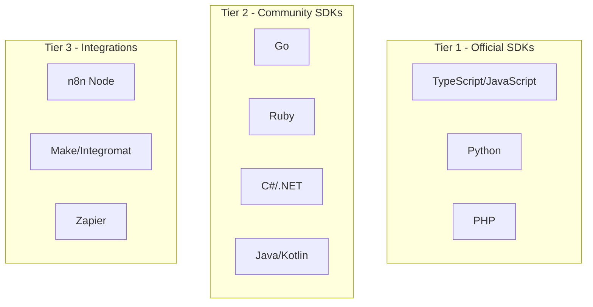

# 18 - SDK Design

## 18.1 Overview

OpenWA provides official SDKs for multiple programming languages to simplify API integration. This document describes the SDK design and specifications.

### Supported Languages



### Design Principles

1. **Idiomatic** - Follow each language's conventions
2. **Type-safe** - Full type definitions for IDE support
3. **Async-first** - Native async/await support
4. **Minimal dependencies** - Only required dependencies
5. **Consistent** - Consistent API across languages
6. **Well-documented** - Inline docs and examples

## 18.2 TypeScript/JavaScript SDK

### Installation

```bash
# npm
npm install @openwa/sdk

# yarn
yarn add @openwa/sdk

# pnpm
pnpm add @openwa/sdk
```

### Quick Start

```typescript
import { OpenWA } from '@openwa/sdk';

const client = new OpenWA({
  baseUrl: 'http://localhost:2785',
  apiKey: 'your-api-key',
});

// Create session
const session = await client.sessions.create({
  id: 'my-session',
  name: 'My WhatsApp',
});

// Wait for QR code
client.on('session.qr', ({ sessionId, qr }) => {
  if (sessionId !== 'my-session') return;
  console.log('Scan this QR:', qr);
});

// Wait for session ready
client.on('session.status', async ({ sessionId, status }) => {
  if (sessionId !== 'my-session' || status !== 'ready') return;

  // Send message
  const message = await client.messages.send('my-session', {
    phone: '628123456789@c.us',
    type: 'text',
    body: 'Hello from SDK!',
  });

  console.log('Message sent:', message.id);
});
```

### SDK Architecture

```typescript
// src/index.ts

export interface OpenWAConfig {
  baseUrl: string;
  apiKey: string;
  timeout?: number;
  retries?: number;
  debug?: boolean;
}

export class OpenWA extends EventEmitter {
  private config: OpenWAConfig;
  private http: HttpClient;
  private ws: WebSocketClient;

  // Resource managers
  public sessions: SessionsResource;
  public messages: MessagesResource;
  public contacts: ContactsResource;
  public groups: GroupsResource;
  public webhooks: WebhooksResource;
  public apiKeys: ApiKeysResource;

  constructor(config: OpenWAConfig) {
    super();
    this.config = this.validateConfig(config);
    this.http = new HttpClient(this.config);
    this.ws = new WebSocketClient(this.config);

    // Initialize resources
    this.sessions = new SessionsResource(this.http);
    this.messages = new MessagesResource(this.http);
    this.contacts = new ContactsResource(this.http);
    this.groups = new GroupsResource(this.http);
    this.webhooks = new WebhooksResource(this.http);
    this.apiKeys = new ApiKeysResource(this.http);

    // Setup WebSocket events
    this.setupWebSocket();
  }

  private setupWebSocket(): void {
    this.ws.on('message', event => {
      this.emit(event.type, event.data);
    });
  }

  // Utility methods
  async health(): Promise<HealthResponse> {
    return this.http.get('/health');
  }

  async healthDetailed(): Promise<DetailedHealthResponse> {
    return this.http.get('/health/detailed');
  }
}
```

### Resource Classes

```typescript
// src/resources/sessions.ts

export interface Session {
  id: string;
  name: string;
  status: SessionStatus;
  phoneNumber?: string;
  profileName?: string;
  profilePicture?: string;
  createdAt: string;
  lastSeen?: string;
}

export type SessionStatus = 'INITIALIZING' | 'SCAN_QR' | 'CONNECTING' | 'CONNECTED' | 'DISCONNECTED' | 'FAILED';

export interface CreateSessionInput {
  id?: string;
  name?: string;
  config?: {
    autoReconnect?: boolean;
    webhookUrl?: string;
    proxy?: string;
  };
}

export class SessionsResource {
  constructor(private http: HttpClient) {}

  async list(params?: ListParams): Promise<PaginatedResponse<Session>> {
    return this.http.get('/api/sessions', { params });
  }

  async create(input: CreateSessionInput): Promise<Session> {
    return this.http.post('/api/sessions', input);
  }

  async get(id: string): Promise<Session> {
    return this.http.get(`/api/sessions/${id}`);
  }

  async delete(id: string, keepAuth = false): Promise<void> {
    return this.http.delete(`/api/sessions/${id}`, {
      params: { keepAuth },
    });
  }

  async getQr(id: string, format: 'base64' | 'raw' = 'base64'): Promise<QrResponse> {
    return this.http.get(`/api/sessions/${id}/qr`, {
      params: { format },
    });
  }

  async restart(id: string): Promise<Session> {
    return this.http.post(`/api/sessions/${id}/restart`);
  }

  async logout(id: string): Promise<void> {
    return this.http.post(`/api/sessions/${id}/logout`);
  }
}
```

```typescript
// src/resources/messages.ts

export type MessageType =
  | 'text'
  | 'image'
  | 'video'
  | 'audio'
  | 'document'
  | 'location'
  | 'contact'
  | 'sticker'
  | 'buttons'
  | 'list';

export interface Message {
  id: string;
  from: string;
  to: string;
  type: MessageType;
  body?: string;
  caption?: string;
  timestamp: string;
  status: MessageStatus;
  isFromMe: boolean;
  hasMedia: boolean;
  media?: MediaInfo;
}

export interface SendMessageInput {
  phone: string;
  type: MessageType;
  body?: string;
  caption?: string;
  media?: MediaInput;
  location?: LocationInput;
  contact?: ContactInput;
  buttons?: ButtonInput[];
  sections?: ListSection[];
  options?: MessageOptions;
}

export interface MediaInput {
  url?: string;
  base64?: string;
  mimetype?: string;
  filename?: string;
}

export class MessagesResource {
  constructor(private http: HttpClient) {}

  async send(sessionId: string, input: SendMessageInput): Promise<Message> {
    return this.http.post(`/api/sessions/${sessionId}/messages`, input);
  }

  async sendFile(
    sessionId: string,
    phone: string,
    file: File | Buffer | ReadStream,
    options?: SendFileOptions,
  ): Promise<Message> {
    const formData = new FormData();
    formData.append('phone', phone);
    formData.append('type', options?.type || 'document');
    formData.append('media', file);

    if (options?.caption) {
      formData.append('caption', options.caption);
    }

    return this.http.post(`/api/sessions/${sessionId}/messages`, formData, {
      headers: { 'Content-Type': 'multipart/form-data' },
    });
  }

  async list(sessionId: string, phone: string, params?: MessageListParams): Promise<PaginatedResponse<Message>> {
    return this.http.get(`/api/sessions/${sessionId}/messages`, {
      params: { phone, ...params },
    });
  }

  async get(sessionId: string, messageId: string): Promise<Message> {
    return this.http.get(`/api/sessions/${sessionId}/messages/${messageId}`);
  }

  async delete(sessionId: string, messageId: string, forEveryone = true): Promise<void> {
    return this.http.delete(`/api/sessions/${sessionId}/messages/${messageId}`, {
      params: { forEveryone },
    });
  }

  async react(sessionId: string, messageId: string, emoji: string): Promise<void> {
    return this.http.post(`/api/sessions/${sessionId}/messages/${messageId}/react`, { emoji });
  }
}
```

### Helper Functions

```typescript
// src/helpers/index.ts

/**
 * Format phone number to WhatsApp JID format
 */
export function formatPhone(phone: string): string {
  // Remove non-numeric characters
  let cleaned = phone.replace(/\D/g, '');

  // Remove leading zeros
  cleaned = cleaned.replace(/^0+/, '');

  // Add country code if needed (assuming Indonesian)
  if (!cleaned.startsWith('62') && cleaned.length <= 12) {
    cleaned = '62' + cleaned;
  }

  return `${cleaned}@c.us`;
}

/**
 * Format group ID to WhatsApp JID format
 */
export function formatGroup(groupId: string): string {
  if (groupId.endsWith('@g.us')) {
    return groupId;
  }
  return `${groupId}@g.us`;
}

/**
 * Check if JID is a group
 */
export function isGroup(jid: string): boolean {
  return jid.endsWith('@g.us');
}

/**
 * Extract phone number from JID
 */
export function extractPhone(jid: string): string {
  return jid.replace(/@[cgs]\.us$/, '');
}

/**
 * Create message builder
 */
export function message(phone: string): MessageBuilder {
  return new MessageBuilder(phone);
}

export class MessageBuilder {
  private input: Partial<SendMessageInput>;

  constructor(phone: string) {
    this.input = { phone: formatPhone(phone) };
  }

  text(body: string): this {
    this.input.type = 'text';
    this.input.body = body;
    return this;
  }

  image(url: string, caption?: string): this {
    this.input.type = 'image';
    this.input.media = { url };
    this.input.caption = caption;
    return this;
  }

  document(url: string, filename: string, caption?: string): this {
    this.input.type = 'document';
    this.input.media = { url, filename };
    this.input.caption = caption;
    return this;
  }

  location(lat: number, lng: number, name?: string): this {
    this.input.type = 'location';
    this.input.location = { latitude: lat, longitude: lng, name };
    return this;
  }

  replyTo(messageId: string): this {
    this.input.options = { ...this.input.options, quotedMessageId: messageId };
    return this;
  }

  build(): SendMessageInput {
    if (!this.input.type) {
      throw new Error('Message type not specified');
    }
    return this.input as SendMessageInput;
  }
}
```

### Event Handling

```typescript
// src/events/index.ts

export interface OpenWAEvents {
  // Session events
  'session.status': (data: SessionStatusEvent) => void;
  'session.qr': (data: SessionQrEvent) => void;
  'session.authenticated': (data: SessionAuthenticatedEvent) => void;
  'session.disconnected': (data: SessionDisconnectedEvent) => void;

  // Message events
  'message.received': (data: MessageEvent) => void;
  'message.sent': (data: MessageEvent) => void;
  'message.ack': (data: MessageAckEvent) => void;
  'message.revoked': (data: MessageRevokedEvent) => void;

  // Group events
  'group.join': (data: GroupJoinEvent) => void;
  'group.leave': (data: GroupLeaveEvent) => void;
  'group.update': (data: GroupUpdateEvent) => void;

  // Contact events
  'contact.update': (data: ContactUpdateEvent) => void;
  'presence.update': (data: PresenceUpdateEvent) => void;
}

export interface MessageEvent {
  sessionId: string;
  message: Message;
}

export interface MessageAckEvent {
  sessionId: string;
  messageId: string;
  ack: 'error' | 'pending' | 'server' | 'device' | 'read' | 'played';
}

// Usage with typed events
const client = new OpenWA({ ... });

client.on('message.received', ({ sessionId, message }) => {
  console.log(`[${sessionId}] New message from ${message.from}: ${message.body}`);
});

client.on('message.ack', ({ messageId, ack }) => {
  console.log(`Message ${messageId} status: ${ack}`);
});
```

### Error Handling

```typescript
// src/errors/index.ts

export class OpenWAError extends Error {
  constructor(
    message: string,
    public code: string,
    public status: number,
    public details?: unknown,
  ) {
    super(message);
    this.name = 'OpenWAError';
  }
}

export class ValidationError extends OpenWAError {
  constructor(message: string, details?: unknown) {
    super(message, 'VALIDATION_ERROR', 400, details);
    this.name = 'ValidationError';
  }
}

export class AuthenticationError extends OpenWAError {
  constructor(message = 'Invalid API key') {
    super(message, 'AUTHENTICATION_ERROR', 401);
    this.name = 'AuthenticationError';
  }
}

export class SessionNotFoundError extends OpenWAError {
  constructor(sessionId: string) {
    super(`Session '${sessionId}' not found`, 'SESSION_NOT_FOUND', 404);
    this.name = 'SessionNotFoundError';
  }
}

export class RateLimitError extends OpenWAError {
  constructor(public retryAfter: number) {
    super(`Rate limited. Retry after ${retryAfter}ms`, 'RATE_LIMIT_EXCEEDED', 429);
    this.name = 'RateLimitError';
  }
}

// Error handling example
try {
  await client.messages.send('session-1', {
    phone: '628123456789@c.us',
    type: 'text',
    body: 'Hello!',
  });
} catch (error) {
  if (error instanceof RateLimitError) {
    console.log(`Rate limited, retry in ${error.retryAfter}ms`);
    await sleep(error.retryAfter);
    // Retry
  } else if (error instanceof SessionNotFoundError) {
    console.log('Session not found, creating new session...');
    await client.sessions.create({ id: 'session-1' });
  } else {
    throw error;
  }
}
```

## 18.3 Python SDK

### Installation

```bash
pip install openwa-sdk
```

### Quick Start

```python
from openwa import OpenWA
import asyncio

async def main():
    client = OpenWA(
        base_url="http://localhost:2785",
        api_key="your-api-key"
    )

    # Create session
    session = await client.sessions.create(
        id="my-session",
        name="My WhatsApp"
    )

    # Send message
    message = await client.messages.send(
        session_id="my-session",
        phone="628123456789@c.us",
        type="text",
        body="Hello from Python!"
    )

    print(f"Message sent: {message.id}")

asyncio.run(main())
```

### SDK Structure

```python
# openwa/__init__.py

from typing import Optional, List, Dict, Any
from dataclasses import dataclass
from enum import Enum
import aiohttp

class SessionStatus(Enum):
    INITIALIZING = "INITIALIZING"
    SCAN_QR = "SCAN_QR"
    CONNECTING = "CONNECTING"
    CONNECTED = "CONNECTED"
    DISCONNECTED = "DISCONNECTED"
    FAILED = "FAILED"

@dataclass
class Session:
    id: str
    name: str
    status: SessionStatus
    phone_number: Optional[str] = None
    profile_name: Optional[str] = None
    created_at: Optional[str] = None

@dataclass
class Message:
    id: str
    from_: str
    to: str
    type: str
    body: Optional[str] = None
    timestamp: Optional[str] = None
    status: Optional[str] = None
    is_from_me: bool = False

class OpenWA:
    def __init__(
        self,
        base_url: str,
        api_key: str,
        timeout: int = 30
    ):
        self.base_url = base_url.rstrip('/')
        self.api_key = api_key
        self.timeout = timeout

        self.sessions = SessionsResource(self)
        self.messages = MessagesResource(self)
        self.contacts = ContactsResource(self)
        self.groups = GroupsResource(self)
        self.webhooks = WebhooksResource(self)

    async def _request(
        self,
        method: str,
        path: str,
        **kwargs
    ) -> Dict[str, Any]:
        headers = {
            "X-API-Key": self.api_key,
            "Content-Type": "application/json"
        }

        async with aiohttp.ClientSession() as session:
            async with session.request(
                method,
                f"{self.base_url}{path}",
                headers=headers,
                timeout=aiohttp.ClientTimeout(total=self.timeout),
                **kwargs
            ) as response:
                data = await response.json()

                if not response.ok:
                    raise OpenWAError(
                        message=data.get("error", {}).get("message", "Unknown error"),
                        code=data.get("error", {}).get("code", "UNKNOWN"),
                        status=response.status
                    )

                return data.get("data", data)

    async def health(self) -> Dict[str, Any]:
        return await self._request("GET", "/health")


class SessionsResource:
    def __init__(self, client: OpenWA):
        self.client = client

    async def list(
        self,
        status: Optional[str] = None,
        limit: int = 20,
        offset: int = 0
    ) -> List[Session]:
        params = {"limit": limit, "offset": offset}
        if status:
            params["status"] = status

        data = await self.client._request(
            "GET",
            "/api/sessions",
            params=params
        )
        return [Session(**s) for s in data]

    async def create(
        self,
        id: Optional[str] = None,
        name: Optional[str] = None,
        **config
    ) -> Session:
        body = {}
        if id:
            body["id"] = id
        if name:
            body["name"] = name
        if config:
            body["config"] = config

        data = await self.client._request(
            "POST",
            "/api/sessions",
            json=body
        )
        return Session(**data)

    async def get(self, id: str) -> Session:
        data = await self.client._request("GET", f"/api/sessions/{id}")
        return Session(**data)

    async def delete(self, id: str, keep_auth: bool = False) -> None:
        await self.client._request(
            "DELETE",
            f"/api/sessions/{id}",
            params={"keepAuth": keep_auth}
        )

    async def get_qr(self, id: str, format: str = "base64") -> Dict[str, str]:
        return await self.client._request(
            "GET",
            f"/api/sessions/{id}/qr",
            params={"format": format}
        )


class MessagesResource:
    def __init__(self, client: OpenWA):
        self.client = client

    async def send(
        self,
        session_id: str,
        phone: str,
        type: str,
        body: Optional[str] = None,
        media: Optional[Dict] = None,
        caption: Optional[str] = None,
        **kwargs
    ) -> Message:
        payload = {
            "phone": phone,
            "type": type,
        }
        if body:
            payload["body"] = body
        if media:
            payload["media"] = media
        if caption:
            payload["caption"] = caption
        payload.update(kwargs)

        data = await self.client._request(
            "POST",
            f"/api/sessions/{session_id}/messages",
            json=payload
        )
        return Message(**data)

    async def send_text(
        self,
        session_id: str,
        phone: str,
        text: str
    ) -> Message:
        return await self.send(session_id, phone, "text", body=text)

    async def send_image(
        self,
        session_id: str,
        phone: str,
        url: str,
        caption: Optional[str] = None
    ) -> Message:
        return await self.send(
            session_id,
            phone,
            "image",
            media={"url": url},
            caption=caption
        )


class OpenWAError(Exception):
    def __init__(self, message: str, code: str, status: int):
        super().__init__(message)
        self.code = code
        self.status = status
```

### Sync Wrapper

```python
# openwa/sync.py

from .async_client import OpenWA as AsyncOpenWA
import asyncio

class OpenWASync:
    """Synchronous wrapper for OpenWA client"""

    def __init__(self, **kwargs):
        self._async_client = AsyncOpenWA(**kwargs)
        self._loop = asyncio.new_event_loop()

    def _run(self, coro):
        return self._loop.run_until_complete(coro)

    @property
    def sessions(self):
        return SessionsResourceSync(self._async_client.sessions, self._run)

    @property
    def messages(self):
        return MessagesResourceSync(self._async_client.messages, self._run)

    def health(self):
        return self._run(self._async_client.health())


class SessionsResourceSync:
    def __init__(self, async_resource, run):
        self._async = async_resource
        self._run = run

    def list(self, **kwargs):
        return self._run(self._async.list(**kwargs))

    def create(self, **kwargs):
        return self._run(self._async.create(**kwargs))

    def get(self, id):
        return self._run(self._async.get(id))

    def delete(self, id, **kwargs):
        return self._run(self._async.delete(id, **kwargs))


# Usage
from openwa.sync import OpenWASync

client = OpenWASync(base_url="http://localhost:2785", api_key="your-key")
sessions = client.sessions.list()
```

## 18.4 PHP SDK

### Installation

```bash
composer require openwa/sdk
```

### Quick Start

```php
<?php

use OpenWA\Client;
use OpenWA\Resources\Messages;

$client = new Client([
    'baseUrl' => 'http://localhost:2785',
    'apiKey' => 'your-api-key',
]);

// Create session
$session = $client->sessions->create([
    'id' => 'my-session',
    'name' => 'My WhatsApp',
]);

// Send message
$message = $client->messages->send('my-session', [
    'phone' => '628123456789@c.us',
    'type' => 'text',
    'body' => 'Hello from PHP!',
]);

echo "Message sent: " . $message->id;
```

### SDK Structure

```php
<?php
// src/Client.php

namespace OpenWA;

use GuzzleHttp\Client as HttpClient;
use OpenWA\Resources\Sessions;
use OpenWA\Resources\Messages;
use OpenWA\Resources\Contacts;
use OpenWA\Resources\Groups;
use OpenWA\Resources\Webhooks;
use OpenWA\Exceptions\OpenWAException;

class Client
{
    private HttpClient $http;
    private array $config;

    public Sessions $sessions;
    public Messages $messages;
    public Contacts $contacts;
    public Groups $groups;
    public Webhooks $webhooks;

    public function __construct(array $config)
    {
        $this->config = array_merge([
            'timeout' => 30,
        ], $config);

        $this->http = new HttpClient([
            'base_uri' => rtrim($this->config['baseUrl'], '/'),
            'timeout' => $this->config['timeout'],
            'headers' => [
                'X-API-Key' => $this->config['apiKey'],
                'Content-Type' => 'application/json',
                'Accept' => 'application/json',
            ],
        ]);

        $this->sessions = new Sessions($this);
        $this->messages = new Messages($this);
        $this->contacts = new Contacts($this);
        $this->groups = new Groups($this);
        $this->webhooks = new Webhooks($this);
    }

    public function request(string $method, string $path, array $options = []): array
    {
        try {
            $response = $this->http->request($method, $path, $options);
            $data = json_decode($response->getBody()->getContents(), true);

            if (!isset($data['success']) || !$data['success']) {
                throw new OpenWAException(
                    $data['error']['message'] ?? 'Unknown error',
                    $data['error']['code'] ?? 'UNKNOWN',
                    $response->getStatusCode()
                );
            }

            return $data['data'] ?? [];
        } catch (\GuzzleHttp\Exception\RequestException $e) {
            $response = $e->getResponse();
            $data = json_decode($response->getBody()->getContents(), true);

            throw new OpenWAException(
                $data['error']['message'] ?? $e->getMessage(),
                $data['error']['code'] ?? 'REQUEST_ERROR',
                $response ? $response->getStatusCode() : 0
            );
        }
    }

    public function health(): array
    {
        return $this->request('GET', '/health');
    }
}
```

```php
<?php
// src/Resources/Sessions.php

namespace OpenWA\Resources;

use OpenWA\Client;
use OpenWA\Models\Session;

class Sessions
{
    private Client $client;

    public function __construct(Client $client)
    {
        $this->client = $client;
    }

    public function list(array $params = []): array
    {
        $data = $this->client->request('GET', '/api/sessions', [
            'query' => $params,
        ]);

        return array_map(fn($s) => new Session($s), $data);
    }

    public function create(array $input): Session
    {
        $data = $this->client->request('POST', '/api/sessions', [
            'json' => $input,
        ]);

        return new Session($data);
    }

    public function get(string $id): Session
    {
        $data = $this->client->request('GET', "/api/sessions/{$id}");
        return new Session($data);
    }

    public function delete(string $id, bool $keepAuth = false): void
    {
        $this->client->request('DELETE', "/api/sessions/{$id}", [
            'query' => ['keepAuth' => $keepAuth],
        ]);
    }

    public function getQr(string $id, string $format = 'base64'): array
    {
        return $this->client->request('GET', "/api/sessions/{$id}/qr", [
            'query' => ['format' => $format],
        ]);
    }

    public function restart(string $id): Session
    {
        $data = $this->client->request('POST', "/api/sessions/{$id}/restart");
        return new Session($data);
    }

    public function logout(string $id): void
    {
        $this->client->request('POST', "/api/sessions/{$id}/logout");
    }
}
```

```php
<?php
// src/Resources/Messages.php

namespace OpenWA\Resources;

use OpenWA\Client;
use OpenWA\Models\Message;

class Messages
{
    private Client $client;

    public function __construct(Client $client)
    {
        $this->client = $client;
    }

    public function send(string $sessionId, array $input): Message
    {
        $data = $this->client->request(
            'POST',
            "/api/sessions/{$sessionId}/messages",
            ['json' => $input]
        );

        return new Message($data);
    }

    public function sendText(string $sessionId, string $phone, string $text): Message
    {
        return $this->send($sessionId, [
            'phone' => $phone,
            'type' => 'text',
            'body' => $text,
        ]);
    }

    public function sendImage(
        string $sessionId,
        string $phone,
        string $url,
        ?string $caption = null
    ): Message {
        return $this->send($sessionId, [
            'phone' => $phone,
            'type' => 'image',
            'media' => ['url' => $url],
            'caption' => $caption,
        ]);
    }

    public function sendDocument(
        string $sessionId,
        string $phone,
        string $url,
        string $filename,
        ?string $caption = null
    ): Message {
        return $this->send($sessionId, [
            'phone' => $phone,
            'type' => 'document',
            'media' => ['url' => $url, 'filename' => $filename],
            'caption' => $caption,
        ]);
    }

    public function list(string $sessionId, string $phone, array $params = []): array
    {
        $data = $this->client->request(
            'GET',
            "/api/sessions/{$sessionId}/messages",
            ['query' => array_merge(['phone' => $phone], $params)]
        );

        return array_map(fn($m) => new Message($m), $data);
    }

    public function delete(string $sessionId, string $messageId, bool $forEveryone = true): void
    {
        $this->client->request(
            'DELETE',
            "/api/sessions/{$sessionId}/messages/{$messageId}",
            ['query' => ['forEveryone' => $forEveryone]]
        );
    }
}
```

## 18.5 n8n Community Node

### Installation

```bash
npm install @rmyndharis/n8n-nodes-openwa
```

### Node Configuration

```typescript
// nodes/OpenWA/OpenWA.node.ts

import { IExecuteFunctions, INodeExecutionData, INodeType, INodeTypeDescription } from 'n8n-workflow';

export class OpenWA implements INodeType {
  description: INodeTypeDescription = {
    displayName: 'OpenWA',
    name: 'openWA',
    icon: 'file:openwa.svg',
    group: ['transform'],
    version: 1,
    subtitle: '={{$parameter["operation"] + ": " + $parameter["resource"]}}',
    description: 'Send WhatsApp messages via OpenWA',
    defaults: {
      name: 'OpenWA',
    },
    inputs: ['main'],
    outputs: ['main'],
    credentials: [
      {
        name: 'openWAApi',
        required: true,
      },
    ],
    properties: [
      // Resource
      {
        displayName: 'Resource',
        name: 'resource',
        type: 'options',
        noDataExpression: true,
        options: [
          { name: 'Message', value: 'message' },
          { name: 'Session', value: 'session' },
          { name: 'Contact', value: 'contact' },
          { name: 'Group', value: 'group' },
        ],
        default: 'message',
      },

      // Message Operations
      {
        displayName: 'Operation',
        name: 'operation',
        type: 'options',
        noDataExpression: true,
        displayOptions: {
          show: { resource: ['message'] },
        },
        options: [
          { name: 'Send Text', value: 'sendText' },
          { name: 'Send Image', value: 'sendImage' },
          { name: 'Send Document', value: 'sendDocument' },
          { name: 'Send Location', value: 'sendLocation' },
        ],
        default: 'sendText',
      },

      // Session ID
      {
        displayName: 'Session ID',
        name: 'sessionId',
        type: 'string',
        default: 'default',
        required: true,
        description: 'The session ID to use',
      },

      // Phone Number
      {
        displayName: 'Phone Number',
        name: 'phone',
        type: 'string',
        default: '',
        required: true,
        displayOptions: {
          show: {
            resource: ['message'],
          },
        },
        description: 'Phone number (e.g., 628123456789)',
      },

      // Message Text
      {
        displayName: 'Message',
        name: 'message',
        type: 'string',
        typeOptions: {
          rows: 4,
        },
        default: '',
        displayOptions: {
          show: {
            resource: ['message'],
            operation: ['sendText'],
          },
        },
        description: 'The message text to send',
      },

      // Image URL
      {
        displayName: 'Image URL',
        name: 'imageUrl',
        type: 'string',
        default: '',
        displayOptions: {
          show: {
            resource: ['message'],
            operation: ['sendImage'],
          },
        },
        description: 'URL of the image to send',
      },

      // Caption
      {
        displayName: 'Caption',
        name: 'caption',
        type: 'string',
        default: '',
        displayOptions: {
          show: {
            resource: ['message'],
            operation: ['sendImage', 'sendDocument'],
          },
        },
        description: 'Caption for the media',
      },
    ],
  };

  async execute(this: IExecuteFunctions): Promise<INodeExecutionData[][]> {
    const items = this.getInputData();
    const returnData: INodeExecutionData[] = [];
    const credentials = await this.getCredentials('openWAApi');

    const baseUrl = credentials.baseUrl as string;
    const apiKey = credentials.apiKey as string;

    for (let i = 0; i < items.length; i++) {
      const resource = this.getNodeParameter('resource', i) as string;
      const operation = this.getNodeParameter('operation', i) as string;
      const sessionId = this.getNodeParameter('sessionId', i) as string;

      let response;

      if (resource === 'message') {
        const phone = this.getNodeParameter('phone', i) as string;
        const formattedPhone = this.formatPhone(phone);

        if (operation === 'sendText') {
          const message = this.getNodeParameter('message', i) as string;

          response = await this.helpers.request({
            method: 'POST',
            url: `${baseUrl}/api/sessions/${sessionId}/messages`,
            headers: { 'X-API-Key': apiKey },
            body: {
              phone: formattedPhone,
              type: 'text',
              body: message,
            },
            json: true,
          });
        } else if (operation === 'sendImage') {
          const imageUrl = this.getNodeParameter('imageUrl', i) as string;
          const caption = this.getNodeParameter('caption', i) as string;

          response = await this.helpers.request({
            method: 'POST',
            url: `${baseUrl}/api/sessions/${sessionId}/messages`,
            headers: { 'X-API-Key': apiKey },
            body: {
              phone: formattedPhone,
              type: 'image',
              media: { url: imageUrl },
              caption,
            },
            json: true,
          });
        }
      }

      returnData.push({ json: response.data });
    }

    return [returnData];
  }

  private formatPhone(phone: string): string {
    let cleaned = phone.replace(/\D/g, '');
    if (!cleaned.endsWith('@c.us')) {
      cleaned = `${cleaned}@c.us`;
    }
    return cleaned;
  }
}
```

### Trigger Node

```typescript
// nodes/OpenWA/OpenWATrigger.node.ts

import { IHookFunctions, IWebhookFunctions, INodeType, INodeTypeDescription, IWebhookResponseData } from 'n8n-workflow';

export class OpenWATrigger implements INodeType {
  description: INodeTypeDescription = {
    displayName: 'OpenWA Trigger',
    name: 'openWATrigger',
    icon: 'file:openwa.svg',
    group: ['trigger'],
    version: 1,
    description: 'Starts workflow on OpenWA events',
    defaults: {
      name: 'OpenWA Trigger',
    },
    inputs: [],
    outputs: ['main'],
    credentials: [
      {
        name: 'openWAApi',
        required: true,
      },
    ],
    webhooks: [
      {
        name: 'default',
        httpMethod: 'POST',
        responseMode: 'onReceived',
        path: 'webhook',
      },
    ],
    properties: [
      {
        displayName: 'Events',
        name: 'events',
        type: 'multiOptions',
        options: [
          { name: 'Message Received', value: 'message.received' },
          { name: 'Message Acknowledged', value: 'message.ack' },
          { name: 'Session Status Change', value: 'session.status' },
          { name: 'QR Code Received', value: 'session.qr' },
        ],
        default: ['message.received'],
        required: true,
      },
      {
        displayName: 'Session Filter',
        name: 'sessionFilter',
        type: 'string',
        default: '',
        description: 'Only trigger for specific session (leave empty for all)',
      },
    ],
  };

  webhookMethods = {
    default: {
      async checkExists(this: IHookFunctions): Promise<boolean> {
        // Check if webhook already exists in OpenWA
        const webhookUrl = this.getNodeWebhookUrl('default');
        const credentials = await this.getCredentials('openWAApi');

        const sessionId = this.getNodeParameter('sessionFilter') as string;
        const response = await this.helpers.request({
          method: 'GET',
          url: `${credentials.baseUrl}/api/sessions/${sessionId}/webhooks`,
          headers: { 'X-API-Key': credentials.apiKey as string },
          json: true,
        });

        return response.data.some((w: any) => w.url === webhookUrl);
      },

      async create(this: IHookFunctions): Promise<boolean> {
        const webhookUrl = this.getNodeWebhookUrl('default');
        const events = this.getNodeParameter('events') as string[];
        const credentials = await this.getCredentials('openWAApi');

        const sessionId = this.getNodeParameter('sessionFilter') as string;
        await this.helpers.request({
          method: 'POST',
          url: `${credentials.baseUrl}/api/sessions/${sessionId}/webhooks`,
          headers: { 'X-API-Key': credentials.apiKey as string },
          body: {
            url: webhookUrl,
            events,
          },
          json: true,
        });

        return true;
      },

      async delete(this: IHookFunctions): Promise<boolean> {
        const webhookUrl = this.getNodeWebhookUrl('default');
        const credentials = await this.getCredentials('openWAApi');

        // Find and delete the webhook
        const sessionId = this.getNodeParameter('sessionFilter') as string;
        const response = await this.helpers.request({
          method: 'GET',
          url: `${credentials.baseUrl}/api/sessions/${sessionId}/webhooks`,
          headers: { 'X-API-Key': credentials.apiKey as string },
          json: true,
        });

        const webhook = response.data.find((w: any) => w.url === webhookUrl);
        if (webhook) {
          await this.helpers.request({
            method: 'DELETE',
            url: `${credentials.baseUrl}/api/sessions/${sessionId}/webhooks/${webhook.id}`,
            headers: { 'X-API-Key': credentials.apiKey as string },
            json: true,
          });
        }

        return true;
      },
    },
  };

  async webhook(this: IWebhookFunctions): Promise<IWebhookResponseData> {
    const body = this.getBodyData() as any;

    return {
      workflowData: [this.helpers.returnJsonArray(body)],
    };
  }
}
```

## 18.6 SDK Release & Versioning

### Version Strategy

SDK versions follow API versions:

```
API v1.0.0 → SDK v1.0.x
API v1.1.0 → SDK v1.1.x
API v2.0.0 → SDK v2.0.x (breaking changes)
```

### Release Checklist

```markdown
## SDK Release Checklist

- [ ] Update version number in package.json/setup.py/composer.json
- [ ] Update CHANGELOG
- [ ] Run all tests
- [ ] Generate/update API types from OpenAPI spec
- [ ] Update documentation
- [ ] Build distribution packages
- [ ] Test installation in clean environment
- [ ] Publish to package registry
- [ ] Tag release in Git
- [ ] Update examples repository
```

---

<div align="center">

[← 17 - Dashboard Design](./17-dashboard-design.md) · [Documentation Index](./README.md) · [Next: 19 - Plugin Architecture →](./19-plugin-architecture.md)

</div>
