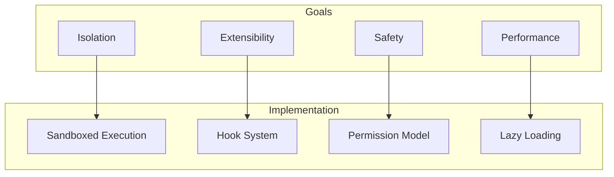
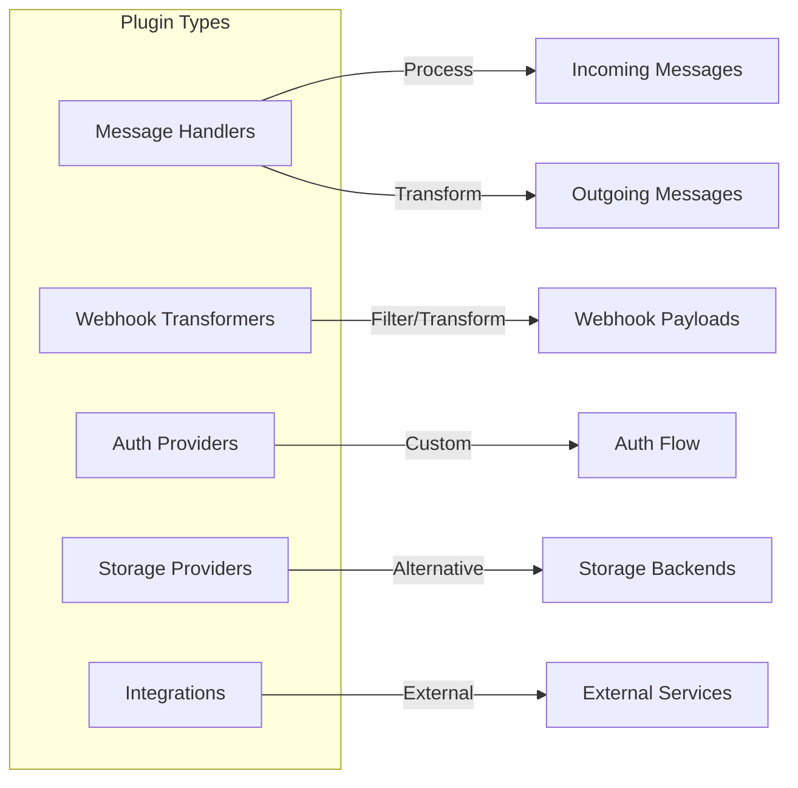
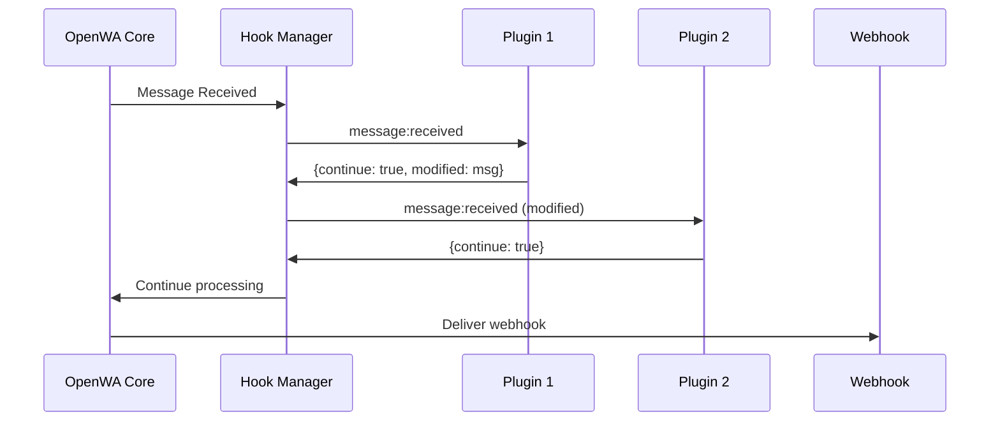

# 19 - Plugin Architecture

## Implementation Status

> **Current Status: ⚠️ Partially Implemented**
>
> The core plugin infrastructure is functional. Advanced features are planned for future releases.

| Component | Status | Location |
|-----------|--------|----------|
| **HookManager** | ✅ Implemented | `src/core/hooks/hook-manager.service.ts` |
| **PluginLoaderService** | ✅ Implemented | `src/core/plugins/plugin-loader.service.ts` |
| **PluginStorageService** | ✅ Implemented | `src/core/plugins/plugin-storage.service.ts` |
| **Manifest loading** | ✅ Implemented | Loads from `plugins/` directory |
| **Plugin lifecycle** | ✅ Implemented | load, enable, disable, unload |
| **Dashboard UI** | ✅ Implemented | `dashboard/src/pages/Plugins.tsx` |
| **REST API** | ✅ Implemented | `src/modules/plugins/plugins.controller.ts` |

| Component | Status | Notes |
|-----------|--------|-------|
| **@openwa/plugin-sdk** | 🔜 Planned | NPM package not yet published |
| **Sandboxed execution** | 🔜 Planned | vm2 isolation not implemented |
| **Permission enforcement** | ⚠️ Partial | Defined in manifest, not enforced |
| **Built-in plugins** | 🔜 Planned | Auto-reply, Translation examples |
| **Plugin marketplace** | 🔜 Planned | Install from npm/github |

---

## 19.1 Overview

The plugin architecture enables OpenWA extensibility without modifying the core codebase. Plugins can add new features, integrate with external services, or customize behavior.

### Design Goals



1. **Isolation** - Plugins cannot compromise the core system
2. **Extensibility** - Easy to add new features
3. **Safety** - Permission-based access control
4. **Performance** - Lazy loading, minimal overhead

## 19.2 Plugin Types

### Type Categories



| Type | Description | Examples |
|------|-------------|----------|
| Message Handler | Process incoming/outgoing messages | Auto-reply, Translation |
| Webhook Transformer | Transform webhook payloads | Add metadata, Filter events |
| Auth Provider | Custom authentication | OAuth, LDAP |
| Storage Provider | Alternative storage backends | Google Drive, Dropbox |
| Integration | External service integration | CRM, Analytics, n8n |

## 19.3 Plugin Structure

### Directory Structure

```
plugins/
├── my-plugin/
│   ├── package.json         # Plugin metadata
│   ├── index.ts              # Entry point
│   ├── manifest.json         # Permissions & config
│   ├── src/
│   │   ├── handlers/         # Message handlers
│   │   ├── hooks/            # Hook implementations
│   │   └── utils/            # Utilities
│   ├── config/
│   │   └── default.json      # Default config
│   └── README.md             # Documentation
```

### Manifest File

```json
{
  "name": "my-awesome-plugin",
  "version": "1.0.0",
  "description": "An awesome plugin for OpenWA",
  "author": "Your Name",
  "license": "MIT",

  "main": "dist/index.js",
  "types": "dist/index.d.ts",

  "openwa": {
    "minVersion": "0.2.0",
    "maxVersion": "2.0.0"
  },

  "permissions": [
    "messages:read",
    "messages:write",
    "contacts:read",
    "storage:read",
    "storage:write",
    "http:outbound"
  ],

  "hooks": [
    "message:received",
    "message:sending",
    "session:connected",
    "webhook:before"
  ],

  "config": {
    "schema": {
      "type": "object",
      "properties": {
        "enabled": {
          "type": "boolean",
          "default": true
        },
        "apiKey": {
          "type": "string",
          "secret": true
        },
        "options": {
          "type": "object",
          "properties": {
            "autoReply": { "type": "boolean", "default": false },
            "language": { "type": "string", "default": "id" }
          }
        }
      }
    }
  }
}
```

### Plugin Entry Point

```typescript
// plugins/my-plugin/index.ts

import { OpenWAPlugin, PluginContext, MessageEvent, HookResult } from '@openwa/plugin-sdk';

export interface MyPluginConfig {
  enabled: boolean;
  apiKey: string;
  options: {
    autoReply: boolean;
    language: string;
  };
}

export default class MyAwesomePlugin implements OpenWAPlugin<MyPluginConfig> {
  name = 'my-awesome-plugin';
  version = '1.0.0';

  private ctx!: PluginContext;
  private config!: MyPluginConfig;

  /**
   * Called when plugin is loaded
   */
  async onLoad(ctx: PluginContext, config: MyPluginConfig): Promise<void> {
    this.ctx = ctx;
    this.config = config;

    ctx.logger.info('Plugin loaded', { version: this.version });

    // Register message handler
    ctx.hooks.on('message:received', this.handleIncomingMessage.bind(this));

    // Register API routes (optional)
    ctx.router.get('/my-plugin/status', this.getStatus.bind(this));
    ctx.router.post('/my-plugin/action', this.doAction.bind(this));
  }

  /**
   * Called when plugin is unloaded
   */
  async onUnload(): Promise<void> {
    this.ctx.logger.info('Plugin unloading');
    // Cleanup resources
  }

  /**
   * Handle incoming message
   */
  async handleIncomingMessage(event: MessageEvent): Promise<HookResult> {
    if (!this.config.enabled) {
      return { continue: true };
    }

    const { message, session } = event;

    // Example: Auto-reply to specific keyword
    if (this.config.options.autoReply && message.body?.toLowerCase() === 'help') {
      await this.ctx.api.messages.send(session.id, {
        phone: message.from,
        type: 'text',
        body: 'How can I help you?',
      });

      // Stop processing (don't trigger webhook)
      return { continue: false };
    }

    // Continue to next handler/webhook
    return { continue: true };
  }

  /**
   * Custom API endpoint
   */
  async getStatus(req: Request, res: Response): Promise<void> {
    res.json({
      plugin: this.name,
      version: this.version,
      enabled: this.config.enabled,
      stats: await this.getStats(),
    });
  }

  async doAction(req: Request, res: Response): Promise<void> {
    // Perform action
    res.json({ success: true });
  }

  private async getStats(): Promise<object> {
    // Get plugin stats from storage
    return this.ctx.storage.get('stats') || {};
  }
}
```

## 19.4 Plugin SDK

### Core Interfaces

```typescript
// @openwa/plugin-sdk/types.ts

export interface OpenWAPlugin<TConfig = any> {
  name: string;
  version: string;

  onLoad(ctx: PluginContext, config: TConfig): Promise<void>;
  onUnload(): Promise<void>;
}

export interface PluginContext {
  // Logging
  logger: Logger;

  // Hook registration
  hooks: HookRegistry;

  // API access (permission-based)
  api: PluginAPI;

  // Plugin storage
  storage: PluginStorage;

  // HTTP router for custom endpoints
  router: PluginRouter;

  // Configuration
  config: ConfigService;

  // Event emitter
  events: EventEmitter;
}

export interface Logger {
  debug(message: string, meta?: object): void;
  info(message: string, meta?: object): void;
  warn(message: string, meta?: object): void;
  error(message: string, meta?: object): void;
}

export interface HookRegistry {
  on(event: HookEvent, handler: HookHandler): void;
  off(event: HookEvent, handler: HookHandler): void;
  once(event: HookEvent, handler: HookHandler): void;
}

export type HookEvent =
  | 'message:received'
  | 'message:sending'
  | 'message:sent'
  | 'message:failed'
  | 'session:created'
  | 'session:connected'
  | 'session:disconnected'
  | 'session:deleted'
  | 'webhook:before'
  | 'webhook:after'
  | 'webhook:error';

export type HookHandler<T = any> = (event: T) => Promise<HookResult>;

export interface HookResult {
  continue: boolean;      // Whether to continue to next handler
  modified?: any;         // Modified event data
  error?: Error;          // Error to stop processing
}
```

### Plugin API

```typescript
// @openwa/plugin-sdk/api.ts

export interface PluginAPI {
  // Sessions (requires: sessions:read/write)
  sessions: {
    list(): Promise<Session[]>;
    get(id: string): Promise<Session>;
    getStatus(id: string): Promise<SessionStatus>;
  };

  // Messages (requires: messages:read/write)
  messages: {
    send(sessionId: string, input: SendMessageInput): Promise<Message>;
    get(sessionId: string, messageId: string): Promise<Message>;
    list(sessionId: string, phone: string): Promise<Message[]>;
  };

  // Contacts (requires: contacts:read/write)
  contacts: {
    list(sessionId: string): Promise<Contact[]>;
    get(sessionId: string, phone: string): Promise<Contact>;
    exists(sessionId: string, phone: string): Promise<boolean>;
  };

  // Groups (requires: groups:read/write)
  groups: {
    list(sessionId: string): Promise<Group[]>;
    get(sessionId: string, groupId: string): Promise<Group>;
    getParticipants(sessionId: string, groupId: string): Promise<Participant[]>;
  };

  // HTTP (requires: http:outbound)
  http: {
    get(url: string, options?: HttpOptions): Promise<HttpResponse>;
    post(url: string, body: any, options?: HttpOptions): Promise<HttpResponse>;
    put(url: string, body: any, options?: HttpOptions): Promise<HttpResponse>;
    delete(url: string, options?: HttpOptions): Promise<HttpResponse>;
  };
}
```

### Plugin Storage

```typescript
// @openwa/plugin-sdk/storage.ts

export interface PluginStorage {
  // Key-value storage (scoped to plugin)
  get<T = any>(key: string): Promise<T | null>;
  set<T = any>(key: string, value: T, ttl?: number): Promise<void>;
  delete(key: string): Promise<void>;
  has(key: string): Promise<boolean>;

  // List operations
  keys(pattern?: string): Promise<string[]>;
  clear(): Promise<void>;

  // Atomic operations
  increment(key: string, by?: number): Promise<number>;
  decrement(key: string, by?: number): Promise<number>;
}
```

## 19.5 Hook System

### Hook Lifecycle



### Hook Implementation

```typescript
// src/core/hooks/hook-manager.ts

export class HookManager {
  private hooks: Map<HookEvent, HookHandler[]> = new Map();
  private pluginHooks: Map<string, Map<HookEvent, HookHandler[]>> = new Map();

  /**
   * Register hook handler for a plugin
   */
  register(pluginId: string, event: HookEvent, handler: HookHandler): void {
    // Get plugin's hooks map
    if (!this.pluginHooks.has(pluginId)) {
      this.pluginHooks.set(pluginId, new Map());
    }

    const pluginMap = this.pluginHooks.get(pluginId)!;
    if (!pluginMap.has(event)) {
      pluginMap.set(event, []);
    }

    pluginMap.get(event)!.push(handler);

    // Add to global hooks
    if (!this.hooks.has(event)) {
      this.hooks.set(event, []);
    }
    this.hooks.get(event)!.push(handler);
  }

  /**
   * Unregister all hooks for a plugin
   */
  unregisterPlugin(pluginId: string): void {
    const pluginMap = this.pluginHooks.get(pluginId);
    if (!pluginMap) return;

    // Remove from global hooks
    for (const [event, handlers] of pluginMap.entries()) {
      const globalHandlers = this.hooks.get(event);
      if (globalHandlers) {
        const filtered = globalHandlers.filter(h => !handlers.includes(h));
        this.hooks.set(event, filtered);
      }
    }

    this.pluginHooks.delete(pluginId);
  }

  /**
   * Execute hooks for an event
   */
  async execute<T>(event: HookEvent, data: T): Promise<HookExecutionResult<T>> {
    const handlers = this.hooks.get(event) || [];
    let currentData = data;
    let shouldContinue = true;

    for (const handler of handlers) {
      try {
        const result = await handler(currentData);

        if (result.modified) {
          currentData = result.modified;
        }

        if (!result.continue) {
          shouldContinue = false;
          break;
        }

        if (result.error) {
          throw result.error;
        }
      } catch (error) {
        // Log error but continue to next handler
        console.error(`Hook handler error for ${event}:`, error);
      }
    }

    return {
      data: currentData,
      shouldContinue,
      handlersExecuted: handlers.length,
    };
  }
}

export interface HookExecutionResult<T> {
  data: T;
  shouldContinue: boolean;
  handlersExecuted: number;
}
```

## 19.6 Plugin Loader

```typescript
// src/core/plugins/plugin-loader.ts

import { OpenWAPlugin, PluginContext, PluginManifest } from './types';
import { HookManager } from '../hooks/hook-manager';
import { PluginSandbox } from './plugin-sandbox';
import { PluginStorageImpl } from './plugin-storage';
import { PluginAPIImpl } from './plugin-api';

export class PluginLoader {
  private plugins: Map<string, LoadedPlugin> = new Map();
  private hookManager: HookManager;

  constructor(
    private pluginDir: string,
    hookManager: HookManager,
  ) {
    this.hookManager = hookManager;
  }

  /**
   * Discover and load all plugins
   */
  async loadAll(): Promise<void> {
    const pluginDirs = await this.discoverPlugins();

    for (const dir of pluginDirs) {
      try {
        await this.load(dir);
      } catch (error) {
        console.error(`Failed to load plugin from ${dir}:`, error);
      }
    }
  }

  /**
   * Load a single plugin
   */
  async load(pluginPath: string): Promise<void> {
    // 1. Read manifest
    const manifest = await this.readManifest(pluginPath);

    // 2. Validate manifest
    this.validateManifest(manifest);

    // 3. Check version compatibility
    this.checkVersionCompatibility(manifest);

    // 4. Check permissions
    await this.checkPermissions(manifest);

    // 5. Load plugin module
    const PluginClass = await this.loadModule(pluginPath, manifest);

    // 6. Create plugin instance
    const plugin = new PluginClass();

    // 7. Create plugin context
    const ctx = this.createContext(manifest);

    // 8. Load configuration
    const config = await this.loadConfig(manifest);

    // 9. Initialize plugin
    await plugin.onLoad(ctx, config);

    // 10. Store loaded plugin
    this.plugins.set(manifest.name, {
      instance: plugin,
      manifest,
      context: ctx,
      config,
    });

    console.log(`Plugin loaded: ${manifest.name}@${manifest.version}`);
  }

  /**
   * Unload a plugin
   */
  async unload(pluginName: string): Promise<void> {
    const loaded = this.plugins.get(pluginName);
    if (!loaded) return;

    // Call plugin cleanup
    await loaded.instance.onUnload();

    // Unregister hooks
    this.hookManager.unregisterPlugin(pluginName);

    // Remove from loaded plugins
    this.plugins.delete(pluginName);

    console.log(`Plugin unloaded: ${pluginName}`);
  }

  /**
   * Reload a plugin
   */
  async reload(pluginName: string): Promise<void> {
    const loaded = this.plugins.get(pluginName);
    if (!loaded) {
      throw new Error(`Plugin ${pluginName} not loaded`);
    }

    const pluginPath = loaded.manifest._path;
    await this.unload(pluginName);
    await this.load(pluginPath);
  }

  /**
   * Create plugin context with permissions
   */
  private createContext(manifest: PluginManifest): PluginContext {
    const permissions = new Set(manifest.permissions);

    return {
      logger: this.createLogger(manifest.name),
      hooks: this.createHookRegistry(manifest.name),
      api: new PluginAPIImpl(permissions),
      storage: new PluginStorageImpl(manifest.name),
      router: this.createRouter(manifest.name),
      config: this.createConfigService(manifest),
      events: this.createEventEmitter(manifest.name),
    };
  }

  private createHookRegistry(pluginId: string) {
    return {
      on: (event: HookEvent, handler: HookHandler) => {
        this.hookManager.register(pluginId, event, handler);
      },
      off: (event: HookEvent, handler: HookHandler) => {
        // Implementation
      },
      once: (event: HookEvent, handler: HookHandler) => {
        // Implementation
      },
    };
  }

  private async discoverPlugins(): Promise<string[]> {
    const fs = require('fs').promises;
    const path = require('path');

    const entries = await fs.readdir(this.pluginDir, { withFileTypes: true });
    const dirs = entries
      .filter((e: any) => e.isDirectory())
      .map((e: any) => path.join(this.pluginDir, e.name));

    return dirs.filter(async (dir: string) => {
      try {
        await fs.access(path.join(dir, 'manifest.json'));
        return true;
      } catch {
        return false;
      }
    });
  }

  // ... other helper methods
}

interface LoadedPlugin {
  instance: OpenWAPlugin;
  manifest: PluginManifest;
  context: PluginContext;
  config: any;
}
```

## 19.7 Built-in Plugins

### Auto-Reply Plugin

```typescript
// plugins/auto-reply/index.ts

import { OpenWAPlugin, PluginContext, MessageEvent } from '@openwa/plugin-sdk';

interface AutoReplyConfig {
  enabled: boolean;
  rules: AutoReplyRule[];
  defaultReply?: string;
}

interface AutoReplyRule {
  trigger: string | RegExp;
  reply: string;
  caseSensitive?: boolean;
  matchType: 'exact' | 'contains' | 'regex' | 'startsWith';
}

export default class AutoReplyPlugin implements OpenWAPlugin<AutoReplyConfig> {
  name = 'auto-reply';
  version = '1.0.0';

  private ctx!: PluginContext;
  private config!: AutoReplyConfig;
  private compiledRules: CompiledRule[] = [];

  async onLoad(ctx: PluginContext, config: AutoReplyConfig): Promise<void> {
    this.ctx = ctx;
    this.config = config;

    // Compile rules for faster matching
    this.compiledRules = this.compileRules(config.rules);

    // Register hook
    ctx.hooks.on('message:received', this.handleMessage.bind(this));

    ctx.logger.info('Auto-reply plugin loaded', {
      rulesCount: this.compiledRules.length,
    });
  }

  async onUnload(): Promise<void> {
    this.ctx.logger.info('Auto-reply plugin unloaded');
  }

  private compileRules(rules: AutoReplyRule[]): CompiledRule[] {
    return rules.map(rule => ({
      ...rule,
      matcher: this.createMatcher(rule),
    }));
  }

  private createMatcher(rule: AutoReplyRule): (text: string) => boolean {
    const trigger = rule.caseSensitive ? rule.trigger : String(rule.trigger).toLowerCase();

    switch (rule.matchType) {
      case 'exact':
        return (text) => text === trigger;
      case 'contains':
        return (text) => text.includes(trigger as string);
      case 'startsWith':
        return (text) => text.startsWith(trigger as string);
      case 'regex':
        const regex = new RegExp(trigger as string, rule.caseSensitive ? '' : 'i');
        return (text) => regex.test(text);
      default:
        return () => false;
    }
  }

  async handleMessage(event: MessageEvent): Promise<HookResult> {
    if (!this.config.enabled) {
      return { continue: true };
    }

    const { message, session } = event;
    const text = this.config.rules[0]?.caseSensitive
      ? message.body || ''
      : (message.body || '').toLowerCase();

    // Find matching rule
    const matchedRule = this.compiledRules.find(rule => rule.matcher(text));

    if (matchedRule) {
      await this.sendReply(session.id, message.from, matchedRule.reply);

      // Track stats
      await this.ctx.storage.increment('stats:replies');

      return { continue: true }; // Still trigger webhook
    }

    // Default reply if configured
    if (this.config.defaultReply) {
      await this.sendReply(session.id, message.from, this.config.defaultReply);
    }

    return { continue: true };
  }

  private async sendReply(sessionId: string, to: string, reply: string): Promise<void> {
    await this.ctx.api.messages.send(sessionId, {
      phone: to,
      type: 'text',
      body: reply,
    });
  }
}

interface CompiledRule extends AutoReplyRule {
  matcher: (text: string) => boolean;
}
```

### Translation Plugin

```typescript
// plugins/translation/index.ts

import { OpenWAPlugin, PluginContext, MessageEvent } from '@openwa/plugin-sdk';

interface TranslationConfig {
  enabled: boolean;
  provider: 'google' | 'deepl' | 'libre';
  apiKey?: string;
  sourceLanguage: 'auto' | string;
  targetLanguage: string;
  translateIncoming: boolean;
  translateOutgoing: boolean;
}

export default class TranslationPlugin implements OpenWAPlugin<TranslationConfig> {
  name = 'translation';
  version = '1.0.0';

  private ctx!: PluginContext;
  private config!: TranslationConfig;

  async onLoad(ctx: PluginContext, config: TranslationConfig): Promise<void> {
    this.ctx = ctx;
    this.config = config;

    if (config.translateIncoming) {
      ctx.hooks.on('message:received', this.translateIncoming.bind(this));
    }

    if (config.translateOutgoing) {
      ctx.hooks.on('message:sending', this.translateOutgoing.bind(this));
    }
  }

  async onUnload(): Promise<void> {}

  async translateIncoming(event: MessageEvent): Promise<HookResult> {
    if (!this.config.enabled || !event.message.body) {
      return { continue: true };
    }

    try {
      const translated = await this.translate(
        event.message.body,
        this.config.sourceLanguage,
        this.config.targetLanguage
      );

      // Add translation to message metadata
      const modified = {
        ...event,
        message: {
          ...event.message,
          metadata: {
            ...event.message.metadata,
            originalText: event.message.body,
            translatedText: translated,
            translatedFrom: this.config.sourceLanguage,
            translatedTo: this.config.targetLanguage,
          },
        },
      };

      return { continue: true, modified };
    } catch (error) {
      this.ctx.logger.error('Translation failed', { error });
      return { continue: true };
    }
  }

  async translateOutgoing(event: MessageEvent): Promise<HookResult> {
    // Similar implementation for outgoing messages
    return { continue: true };
  }

  private async translate(
    text: string,
    from: string,
    to: string
  ): Promise<string> {
    switch (this.config.provider) {
      case 'google':
        return this.translateWithGoogle(text, from, to);
      case 'deepl':
        return this.translateWithDeepL(text, from, to);
      case 'libre':
        return this.translateWithLibre(text, from, to);
      default:
        throw new Error(`Unknown provider: ${this.config.provider}`);
    }
  }

  private async translateWithGoogle(
    text: string,
    from: string,
    to: string
  ): Promise<string> {
    const response = await this.ctx.api.http.post(
      'https://translation.googleapis.com/language/translate/v2',
      {
        q: text,
        source: from === 'auto' ? undefined : from,
        target: to,
        key: this.config.apiKey,
      }
    );

    return response.data.translations[0].translatedText;
  }

  // ... other provider implementations
}
```

## 19.8 Plugin Management API

### REST Endpoints

```typescript
// src/api/plugins/plugins.controller.ts

@Controller('api/plugins')
@UseGuards(ApiKeyGuard)
export class PluginsController {
  constructor(private pluginService: PluginService) {}

  @Get()
  async listPlugins(): Promise<PluginInfo[]> {
    return this.pluginService.listAll();
  }

  @Get(':id')
  async getPlugin(@Param('id') id: string): Promise<PluginInfo> {
    return this.pluginService.get(id);
  }

  @Post(':id/enable')
  async enablePlugin(@Param('id') id: string): Promise<void> {
    await this.pluginService.enable(id);
  }

  @Post(':id/disable')
  async disablePlugin(@Param('id') id: string): Promise<void> {
    await this.pluginService.disable(id);
  }

  @Post(':id/reload')
  async reloadPlugin(@Param('id') id: string): Promise<void> {
    await this.pluginService.reload(id);
  }

  @Get(':id/config')
  async getPluginConfig(@Param('id') id: string): Promise<any> {
    return this.pluginService.getConfig(id);
  }

  @Put(':id/config')
  async updatePluginConfig(
    @Param('id') id: string,
    @Body() config: any
  ): Promise<void> {
    await this.pluginService.updateConfig(id, config);
  }

  @Post('install')
  async installPlugin(@Body() input: InstallPluginInput): Promise<PluginInfo> {
    return this.pluginService.install(input);
  }

  @Delete(':id')
  async uninstallPlugin(@Param('id') id: string): Promise<void> {
    await this.pluginService.uninstall(id);
  }
}

interface PluginInfo {
  id: string;
  name: string;
  version: string;
  description: string;
  author: string;
  enabled: boolean;
  permissions: string[];
  config: any;
}

interface InstallPluginInput {
  source: 'npm' | 'github' | 'local';
  package: string;  // npm package name, github repo, or local path
}
```

## 19.9 Plugin Security

### Permission Model

```typescript
// src/core/plugins/permissions.ts

export const PERMISSIONS = {
  // Sessions
  'sessions:read': 'Read session information',
  'sessions:write': 'Create/delete sessions',

  // Messages
  'messages:read': 'Read messages',
  'messages:write': 'Send messages',

  // Contacts
  'contacts:read': 'Read contacts',
  'contacts:write': 'Block/unblock contacts',

  // Groups
  'groups:read': 'Read group information',
  'groups:write': 'Manage groups',

  // Storage
  'storage:read': 'Read plugin storage',
  'storage:write': 'Write to plugin storage',

  // HTTP
  'http:outbound': 'Make outbound HTTP requests',

  // System
  'system:info': 'Read system information',
  'system:config': 'Read/write system config',
} as const;

export type Permission = keyof typeof PERMISSIONS;

export class PermissionChecker {
  constructor(private allowedPermissions: Set<Permission>) {}

  check(required: Permission): boolean {
    return this.allowedPermissions.has(required);
  }

  require(required: Permission): void {
    if (!this.check(required)) {
      throw new PermissionDeniedError(required);
    }
  }
}

export class PermissionDeniedError extends Error {
  constructor(permission: Permission) {
    super(`Permission denied: ${permission}`);
    this.name = 'PermissionDeniedError';
  }
}
```

### Sandboxed Execution

```typescript
// src/core/plugins/sandbox.ts

import { VM } from 'vm2';

export class PluginSandbox {
  private vm: VM;

  constructor(permissions: Set<Permission>) {
    this.vm = new VM({
      timeout: 10000, // 10 second timeout
      sandbox: {
        // Only expose allowed APIs
        console: this.createSafeConsole(),
        setTimeout: this.createSafeTimeout(),
        setInterval: this.createSafeInterval(),
        // ... other safe APIs
      },
      eval: false,
      wasm: false,
    });
  }

  async execute(code: string, context: object): Promise<any> {
    return this.vm.run(code);
  }

  private createSafeConsole() {
    return {
      log: (...args: any[]) => console.log('[Plugin]', ...args),
      error: (...args: any[]) => console.error('[Plugin]', ...args),
      warn: (...args: any[]) => console.warn('[Plugin]', ...args),
    };
  }

  private createSafeTimeout() {
    return (fn: Function, ms: number) => {
      if (ms > 30000) ms = 30000; // Max 30 seconds
      return setTimeout(fn, ms);
    };
  }

  private createSafeInterval() {
    return (fn: Function, ms: number) => {
      if (ms < 1000) ms = 1000; // Min 1 second
      return setInterval(fn, ms);
    };
  }
}
```
---

<div align="center">

[← 18 - SDK Design](./18-sdk-design.md) · [Documentation Index](./README.md) · [Next: 20 - Community Guidelines →](./20-community-guidelines.md)

</div>
