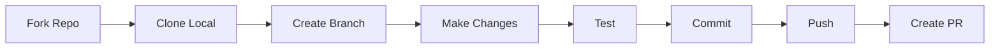
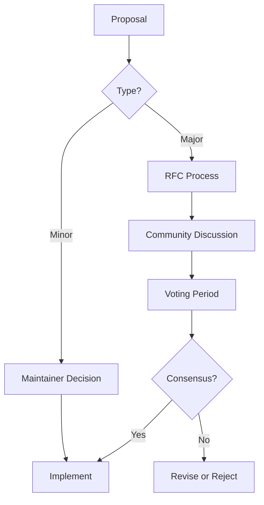

# 20 - Community Guidelines

## 20.1 Code of Conduct

### Our Pledge

OpenWA is committed to providing a welcoming and inclusive environment for everyone. We pledge to make participation in our project and community a harassment-free experience for all, regardless of:

- Age, body size, disability, ethnicity, sex characteristics
- Gender identity and expression
- Level of experience, education, socio-economic status
- Nationality, personal appearance, race, religion
- Sexual identity and orientation

### Our Standards

**Examples of behavior that contributes to a positive environment:**

- Using welcoming and inclusive language
- Being respectful of differing viewpoints and experiences
- Gracefully accepting constructive criticism
- Focusing on what is best for the community
- Showing empathy towards other community members

**Examples of unacceptable behavior:**

- Trolling, insulting/derogatory comments, and personal or political attacks
- Public or private harassment
- Publishing others' private information without explicit permission
- Spam, excessive self-promotion, or off-topic content
- Any conduct which could reasonably be considered inappropriate in a professional setting

### Enforcement

Project maintainers are responsible for clarifying the standards and will take appropriate and fair corrective action in response to any unacceptable behavior.

Project maintainers have the right to remove, edit, or reject comments, commits, code, wiki edits, issues, and other contributions that do not align with this Code of Conduct.

## 20.2 Contributing Guidelines

### Getting Started



### Development Setup

```bash
# 1. Fork the repository on GitHub

# 2. Clone your fork
git clone https://github.com/YOUR_USERNAME/openwa.git
cd openwa

# 3. Add upstream remote
git remote add upstream https://github.com/rmyndharis/OpenWA.git

# 4. Install dependencies
npm install

# 5. Copy environment file
cp .env.example .env

# 6. Start development
npm run dev
```

### Branch Naming

```
feature/     - New features
bugfix/      - Bug fixes
hotfix/      - Critical production fixes
docs/        - Documentation changes
refactor/    - Code refactoring
test/        - Test additions/modifications

Examples:
- feature/add-group-management
- bugfix/fix-qr-timeout
- docs/update-api-reference
- refactor/session-manager
```

### Commit Messages

We follow [Conventional Commits](https://www.conventionalcommits.org/):

```
<type>(<scope>): <description>

[optional body]

[optional footer(s)]
```

**Types:**
- `feat`: A new feature
- `fix`: A bug fix
- `docs`: Documentation only changes
- `style`: Changes that don't affect code meaning (formatting, etc.)
- `refactor`: Code change that neither fixes a bug nor adds a feature
- `perf`: Performance improvement
- `test`: Adding missing tests
- `chore`: Changes to build process or auxiliary tools

**Examples:**

```
feat(sessions): add support for multiple proxy configurations

fix(webhook): resolve timeout issue on slow connections

docs(api): update message endpoint documentation

refactor(database): migrate to TypeORM repository pattern
```

### Pull Request Process

1. **Before submitting:**
   - Ensure tests pass: `npm test`
   - Lint your code: `npm run lint`
   - Update documentation if needed
   - Rebase on latest `main`

2. **PR Description Template:**

```markdown
## Description
Brief description of changes

## Type of Change
- [ ] Bug fix (non-breaking change which fixes an issue)
- [ ] New feature (non-breaking change which adds functionality)
- [ ] Breaking change (fix or feature that causes existing functionality to change)
- [ ] Documentation update

## Testing
Describe how you tested your changes

## Checklist
- [ ] My code follows the project's style guidelines
- [ ] I have performed a self-review of my code
- [ ] I have commented my code, particularly in hard-to-understand areas
- [ ] I have made corresponding changes to the documentation
- [ ] My changes generate no new warnings
- [ ] I have added tests that prove my fix is effective or feature works
- [ ] New and existing unit tests pass locally with my changes
```

3. **Review Process:**
   - At least one maintainer approval required
   - All CI checks must pass
   - Address all review comments
   - Squash commits if requested

### Code Style

**TypeScript:**

```typescript
// Use explicit types
function sendMessage(sessionId: string, phone: string, text: string): Promise<Message> {
  // ...
}

// Use interfaces for complex types
interface SendMessageOptions {
  quotedMessageId?: string;
  mentions?: string[];
}

// Document public APIs
/**
 * Sends a text message to the specified phone number
 * @param sessionId - The session to use for sending
 * @param phone - Phone number in format 628xxx@c.us
 * @param text - Message text content
 * @returns Promise resolving to the sent message
 */
async function sendTextMessage(
  sessionId: string,
  phone: string,
  text: string
): Promise<Message> {
  // ...
}
```

**Naming Conventions:**

| Type | Convention | Example |
|------|------------|---------|
| Classes | PascalCase | `SessionManager` |
| Interfaces | PascalCase with I prefix (optional) | `Session` or `ISession` |
| Functions | camelCase | `sendMessage` |
| Variables | camelCase | `sessionCount` |
| Constants | UPPER_SNAKE_CASE | `MAX_SESSIONS` |
| Files | kebab-case | `session-manager.ts` |

## 20.3 Issue Guidelines

### Bug Reports

Use the bug report template:

```markdown
## Bug Description
Clear and concise description of the bug

## Environment
- OpenWA Version:
- Node.js Version:
- OS:
- Docker Version (if applicable):
- Database: SQLite / PostgreSQL

## Steps to Reproduce
1. Go to '...'
2. Click on '....'
3. Scroll down to '....'
4. See error

## Expected Behavior
What you expected to happen

## Actual Behavior
What actually happened

## Screenshots/Logs
If applicable, add screenshots or logs

## Additional Context
Any other relevant information
```

### Feature Requests

Use the feature request template:

```markdown
## Feature Description
Clear description of the feature you'd like

## Use Case
Why do you need this feature? What problem does it solve?

## Proposed Solution
If you have a solution in mind, describe it here

## Alternatives Considered
Other solutions you've considered

## Additional Context
Any other relevant information, mockups, or examples
```

### Issue Labels

| Label | Description |
|-------|-------------|
| `bug` | Something isn't working |
| `enhancement` | New feature or request |
| `documentation` | Improvements to docs |
| `good first issue` | Good for newcomers |
| `help wanted` | Extra attention needed |
| `question` | Further information requested |
| `wontfix` | This will not be worked on |
| `duplicate` | This issue already exists |
| `priority:high` | High priority issue |
| `priority:low` | Low priority issue |

## 20.4 Community Channels

### GitHub Discussions

Primary community forum for:
- Questions and answers
- Feature discussions
- Show and tell
- General discussions

Categories:
- **Announcements**: Official announcements from maintainers
- **Q&A**: Questions about using OpenWA
- **Ideas**: Feature suggestions and brainstorming
- **Show and Tell**: Share your projects using OpenWA
- **General**: General discussion

### Discord Server (Optional)

Real-time chat for:
- Quick questions
- Community support
- Development discussions

Channels:
- `#general` - General discussion
- `#support` - Help with OpenWA
- `#development` - Development discussions
- `#showcase` - Share your projects
- `#off-topic` - Non-OpenWA discussions

### Support Priority

1. **GitHub Issues** - Bug reports and feature requests
2. **GitHub Discussions** - Questions and general discussion
3. **Discord** - Quick questions and community chat

## 20.5 Governance

### Decision Making



### RFC Process (Request for Comments)

For major changes:

1. **Create RFC** - Submit RFC in `rfcs/` directory
2. **Discussion** - Community discusses for 2 weeks
3. **Voting** - Maintainers vote
4. **Decision** - Accept, revise, or reject
5. **Implementation** - If accepted, implement

RFC Template:

```markdown
# RFC: [Title]

## Summary
One paragraph explanation

## Motivation
Why are we doing this?

## Detailed Design
Technical details of the implementation

## Drawbacks
Why should we NOT do this?

## Alternatives
What other designs have been considered?

## Unresolved Questions
What related issues are out of scope?
```

### Maintainer Roles

| Role | Responsibilities |
|------|------------------|
| **Owner** | Final decision authority, project direction |
| **Maintainer** | Code review, merge PRs, triage issues |
| **Committer** | Merge own PRs after approval |
| **Contributor** | Submit PRs, report issues |

### Becoming a Maintainer

Maintainer status is earned through:
- Consistent quality contributions
- Helpful community participation
- Understanding of project goals
- Positive collaboration

Process:
1. Nominated by existing maintainer
2. Discussion among maintainers
3. Unanimous approval required

## 20.6 Recognition

### Contributors

All contributors are recognized in:
- `CONTRIBUTORS.md` file
- Release notes
- README acknowledgments

### Contribution Types

We value all contributions:
- Code contributions
- Documentation improvements
- Bug reports
- Feature suggestions
- Community support
- Translations
- Design contributions

### Acknowledgment

```markdown
## Contributors

Thanks to all the people who have contributed to OpenWA!

<!-- ALL-CONTRIBUTORS-LIST:START -->
<!-- ALL-CONTRIBUTORS-LIST:END -->

This project follows the [all-contributors](https://github.com/all-contributors/all-contributors) specification.
```

## 20.7 Security Policy

### Reporting Vulnerabilities

**DO NOT** report security vulnerabilities through public GitHub issues.

Instead:
1. Email: security@openwa.dev
2. Use GitHub Security Advisories (private)

Include:
- Type of vulnerability
- Full paths of affected files
- Step-by-step instructions to reproduce
- Proof-of-concept or exploit code
- Impact assessment

### Response Timeline

| Severity | Initial Response | Resolution Target |
|----------|------------------|-------------------|
| Critical | 24 hours | 7 days |
| High | 48 hours | 14 days |
| Medium | 7 days | 30 days |
| Low | 14 days | 90 days |

### Disclosure Policy

- We will acknowledge receipt within 48 hours
- We will confirm the vulnerability and work on a fix
- We will notify you when the fix is released
- We will credit you in the security advisory (unless you prefer anonymity)
---

<div align="center">

[← 19 - Plugin Architecture](./19-plugin-architecture.md) · [Documentation Index](./README.md) · [Next: 21 - Glossary →](./21-glossary.md)

</div>
